# NEXUS Prime 制造业 ERP 全量交付报告

报告日期：2026-06-29

## 0. 线上地址和演示账号

- 前端可分享地址：`https://constantine-d3gjhwmtz0336c36a-1448158108.tcloudbaseapp.com/nexus-prime-fulldata-06292135-44aed6a/`
- 后端 API Base：`https://nexus-api-fulldata-06292135-44aed6a-276095-6-1448158108.sh.run.tcloudbase.com/api/v1`
- 完整数据库压缩资产：`https://constantine-d3gjhwmtz0336c36a-1448158108.tcloudbaseapp.com/nexus-data/nexus_prime_full_06292108.db.gz`
- 管理员账号：`admin@nexus.com / admin123`
- 普通演示账号：`user00001@nexus.com / password123`，本地完整库还包含 `user00002` 到 `user15000` 等批量用户。

本次云端部署已经不再使用小型演示库，而是上传并引导启动本地完整 SQLite 数据库。完整库原始大小约 244MB，压缩后约 46MB，先上传到 CloudBase 静态托管，再由 CloudRun 启动脚本下载、解压、校验并作为运行数据库。

云端验证结果：管理员和普通用户登录均返回 HTTP 200；完整数据诊断显示用户、商品、伙伴、销售订单、采购订单、库存、应收和报表均为本地完整库规模。

## 1. 完整数据规模

| 表 | 含义 | 云端数量 |
| --- | --- | ---: |
| `auth_users` | 用户账号 | 15001 |
| `biz_products` | 物料商品 | 57609 |
| `biz_partners` | 客户供应商伙伴 | 25200 |
| `trade_orders` | 销售订单 | 100803 |
| `trade_order_items` | 销售明细 | 201603 |
| `purchase_orders` | 采购订单 | 46803 |
| `purchase_order_items` | 采购明细 | 93603 |
| `finance_receivables` | 应收账款 | 80640 |
| `finance_payments` | 收款记录 | 70560 |
| `stock_quantities` | 库存数量 | 111360 |
| `stock_logs` | 库存日志 | 111360 |
| `sys_notifications` | 系统通知 | 32431 |
| `sys_audit_logs` | 审计日志 | 7694 |
| `cms_articles` | 公告知识文章 | 16200 |
| `generated_reports` | 生成报表 | 16200 |

## 2. 架构设计

系统采用 Angular 21 SPA + Flask REST API + SQLAlchemy/Alembic 的前后端分离架构。首页、登录页和注册页保持原样；登录后的 `/app/**` 业务区统一进入 App Shell，由左侧 Dock、顶部导航、模块面板和页面工作台共同管理。

后端仍采用模块化单体部署，目的是让课程演示和腾讯云 CloudBase 上线更稳定；代码内部已经按身份、库存、采购、销售、财务、工作流、报表、内容、文件和 AI 划分领域，后续可以把库存、财务、AI、文件拆为独立服务。

```text
CloudBase Static Hosting
  Angular SPA / runtime-config.js
        | HTTPS + Cookie + CSRF
CloudBase CloudRun
  Flask /api/v1 / Auth / Policy / Audit / Domain Services
        | SQLAlchemy
SQLite full demo DB bootstrapped from CloudBase asset
```

## 3. ER 图和数据模型

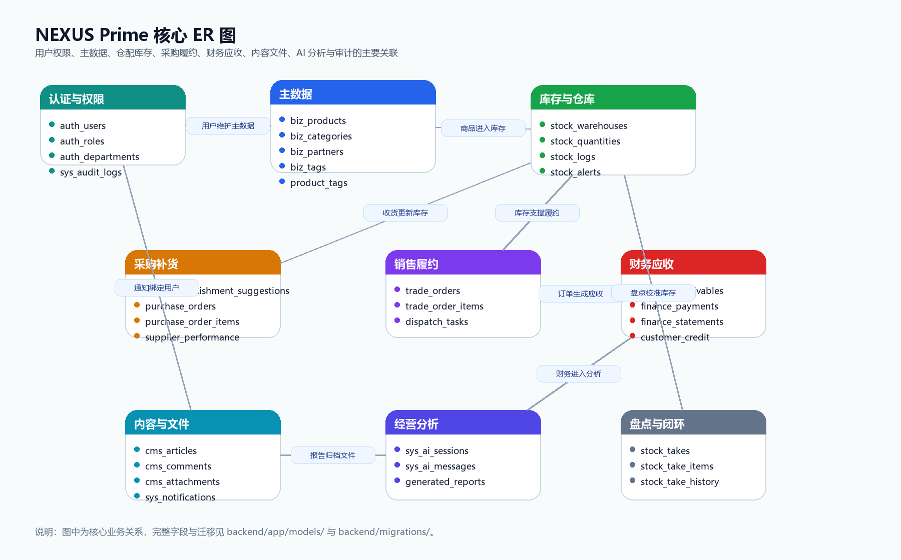

数据库按业务领域拆分为身份权限、主数据、库存仓配、采购、销售履约、财务应收、盘点、工作流、内容文件、报表分析、通知审计、AI 会话和异步事件。关键关系包括：商品和仓库通过库存数量表关联；销售订单形成应收账款；应收账款通过收款记录核销；补货建议可转为采购订单；采购订单和销售订单都关联明细；用户动作写入审计日志。

### 身份权限与主数据 ER

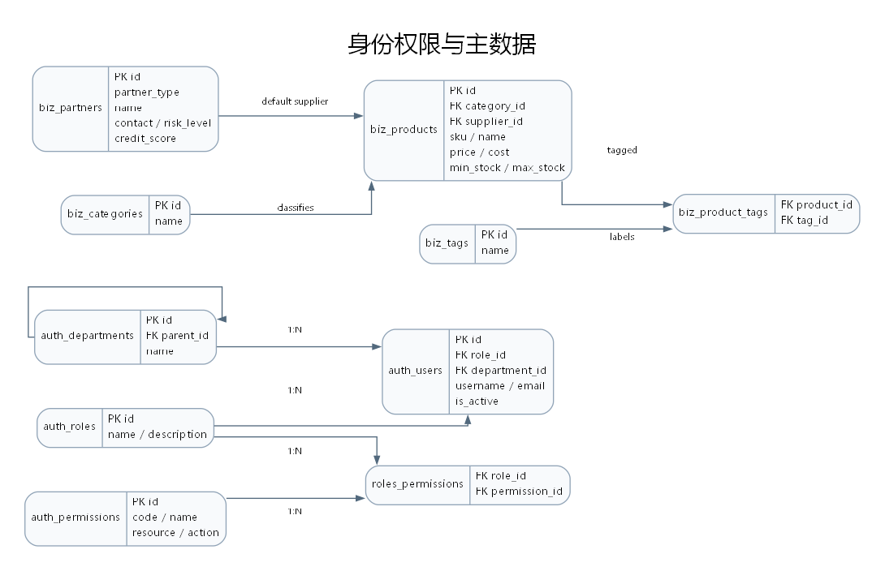

该图覆盖账号、角色、权限、部门、客户供应商、物料分类、物料标签和商品主数据。身份权限决定谁能进入系统、能执行哪些动作；主数据则是采购、库存、销售、财务等后续交易的共同事实源。

### 库存仓配与采购补货 ER

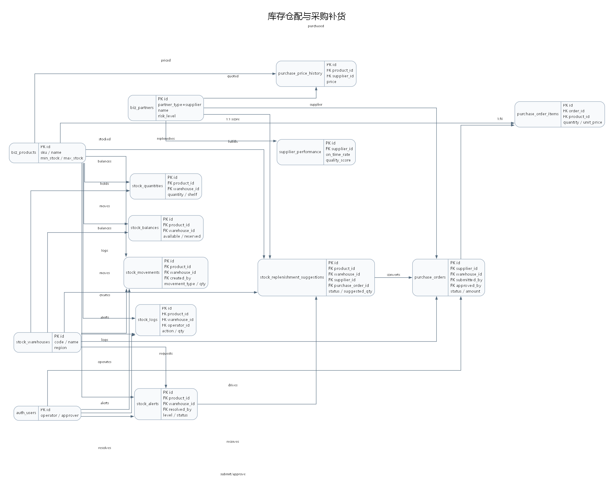

该图覆盖仓库、库存数量、库存余额、库存流水、库存预警、补货建议、采购订单、采购明细、供应商报价和供应商绩效。它解释了从低库存识别到补货建议、采购审批、收货入库、供应商评分的闭环。

### 销售履约、财务应收与盘点 ER

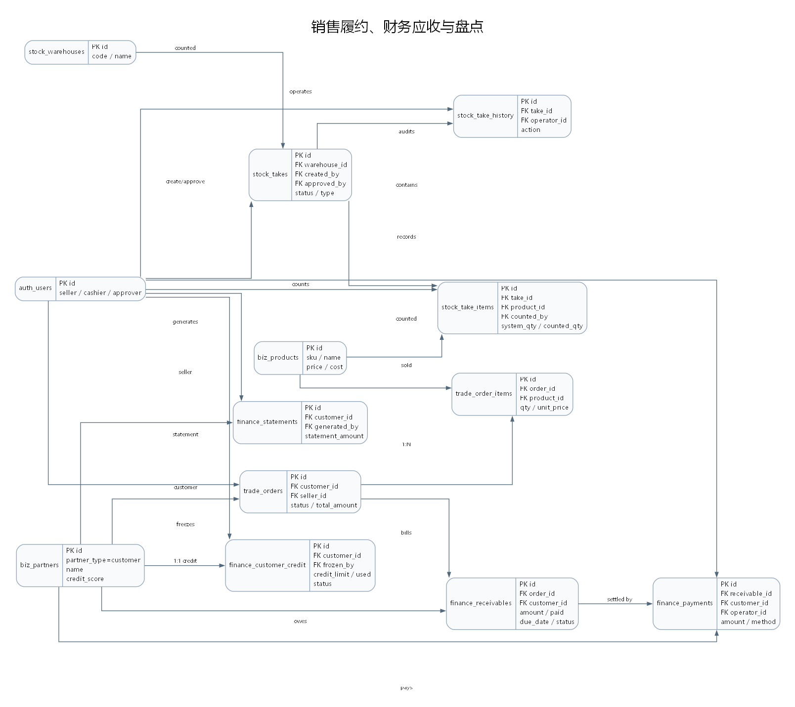

该图覆盖销售订单、销售明细、客户信用、应收、收款、对账单、盘点单、盘点明细和盘点历史。它解释了销售发货后如何形成应收，收款如何核销账龄，盘点差异如何回写库存并进入审计。

### 工作流、协作、报表与 AI ER

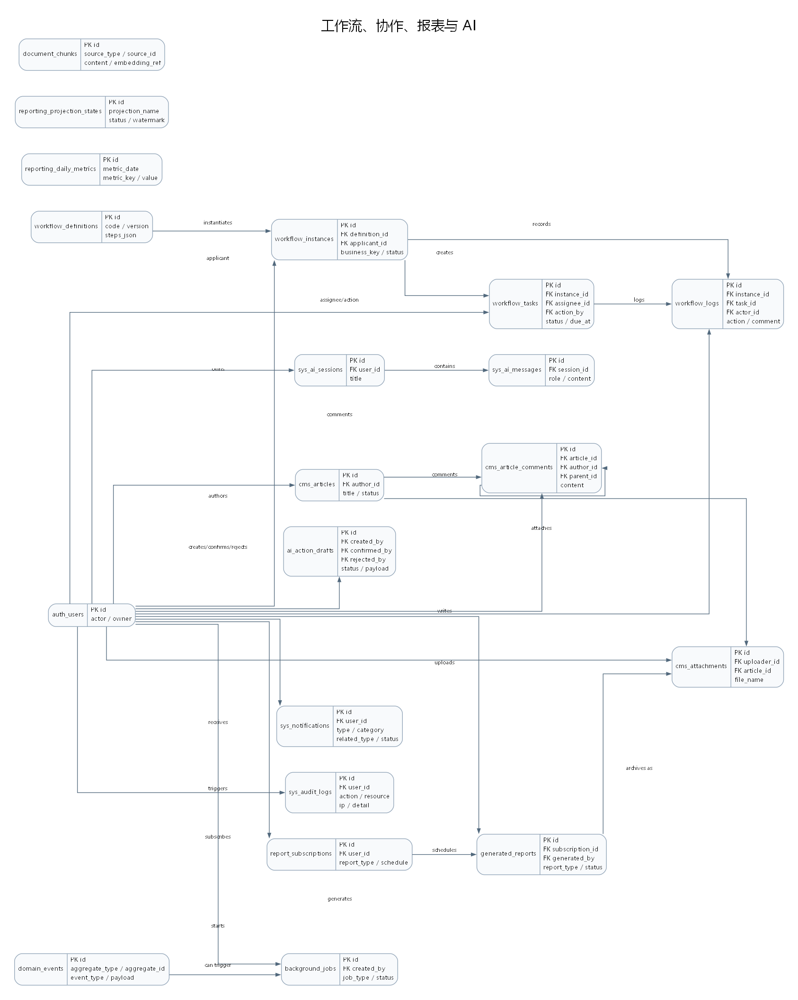

该图覆盖流程定义、流程实例、流程任务、流程日志、通知、公告、评论、附件、报表订阅、生成报表、AI 会话、AI 消息、行动草稿、文档分块、后台任务和领域事件。它解释了系统如何把业务动作变成任务、消息、报表、AI 建议和审计证据。

## 4. 前端升级思路

- **导航逻辑统一**：原来左侧 Dock、省略号、页面顶部卡片和页面内部跳转并行存在，用户会被迫在多套规则之间猜测入口。本轮把 `/app/**` 全部纳入 `navigation.ts` 和 App Shell，Dock 是一级业务流程，顶部栏是当前位置、搜索和全局动作，模块操作台是当前资源的增删查改。
- **Dock 交互收敛**：Dock 删除按钮拉长动画，不再让按钮 hover 后挤占空间；所有入口按业务域分组展示，一行一个稳定按钮，图标、短标签、当前态和浮窗名称共同表达含义。这样既保留文字说明，也避免动画导致布局跳动。
- **顶部栏合并**：顶部栏从零散按钮升级为统一控制面。搜索栏负责跨物料、订单、客户、报表的命令搜索；头像区域只承担个人工作台和退出；主题切换只保留深色和亮色两个可理解状态；服务健康、通知和快捷创建都放在同一层级。
- **页面结构统一**：每个业务页面都遵循“真实图/关键图表在上，交互报表在中，表格、表单、分页和 CRUD 在下”的布局。运营页的设计理念被推广到库存、采购、销售、财务、AI、个人页和设置页，减少孤立方框和未利用空白。
- **空间利用优化**：大面积空白区域不再放无意义卡片，而是放交互报表、执行队列、图表说明、分页表格和当前模块操作台。每页控制长度，信息分层清晰，避免上下页显示不全和底部操作台被挤出视口。
- **数据与部署兜底**：云端不再使用小型演示库，而是上传本地完整库。启动脚本会验证用户数和销售订单数，避免迁移空库后前端看起来正常但数据缺失。报告也把云端数据量列出，便于验收。

## 5. 公共入口页面（暗色主题截图，源码未改）

首页、登录页、注册页和注册协议页严格保持原样。本报告只在截图阶段设置暗色主题偏好，用来满足入口流程统一暗色展示要求；这不是源码改动。

### 首页入口

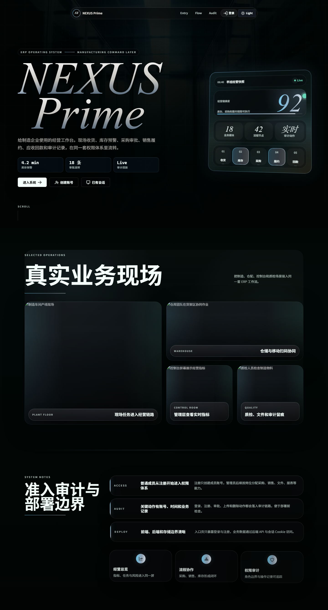

首页保持原样，仅在报告中使用暗色主题截图。它承担品牌入口、产品气质和进入登录流程的第一视觉锚点。

### 登录页

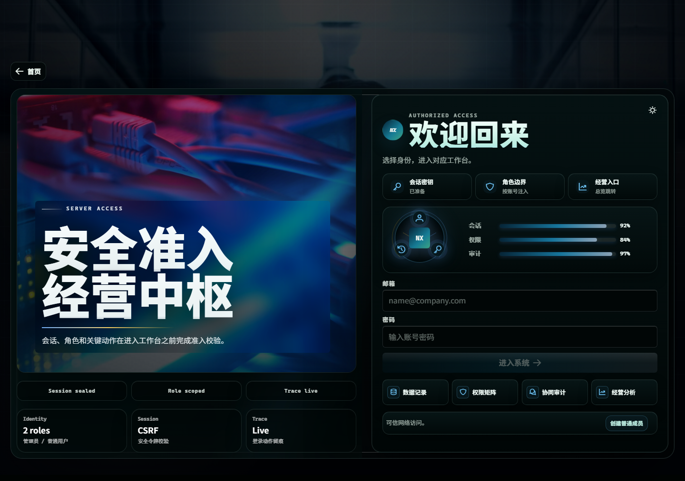

登录页保持原样，仅在报告中使用暗色主题截图。它承担账号密码登录、注册切换、会话建立和 CSRF 初始化。

### 注册页

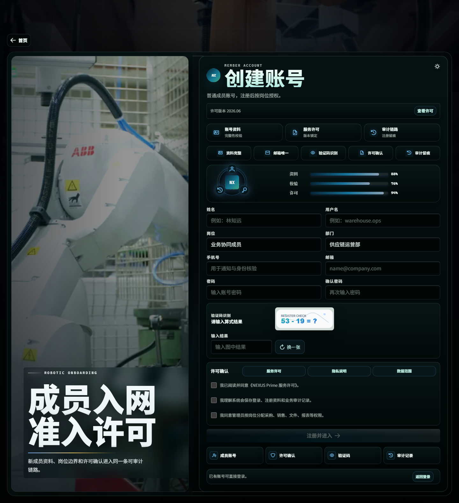

注册页保持原样，仅在报告中使用暗色主题截图。它承担普通用户准入、资料填写、协议确认和验证码校验。

### 注册协议页

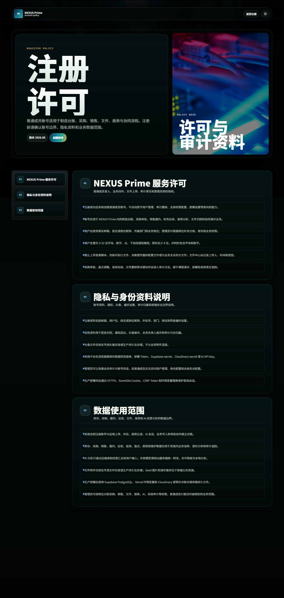

注册协议页保持原样，仅在报告中使用暗色主题截图。它承担注册规则、隐私说明和用户准入边界说明。

## 6. 全部业务页面截图和功能说明（暗色/亮色交替）

业务页按顺序使用深色驾驶舱与亮色系统交替截图。这样报告既能展示两套主题，也能证明页面结构在不同对比条件下都能保持可读。

### 1. 运营控制塔

- 路由：`/app/overview`
- 桌面截图：`docs/images/final/pages/desktop-dark-cockpit-overview.png`（深色驾驶舱）
- 移动截图：`docs/images/final/pages/mobile-light-luxury-overview.png`
- 页面定位：作为登录后的总览页，把库存、采购、销售、应收、异常任务和经营风险合并为一个运营控制塔。
- 主要数据：制造指挥中心、待办任务、异常队列、库存和财务摘要。
- 主要接口：`manufacturing/command-center, operations/todo, operations/exceptions`
- 代码关联：`AppShell + command-center.page.ts + operations APIs`

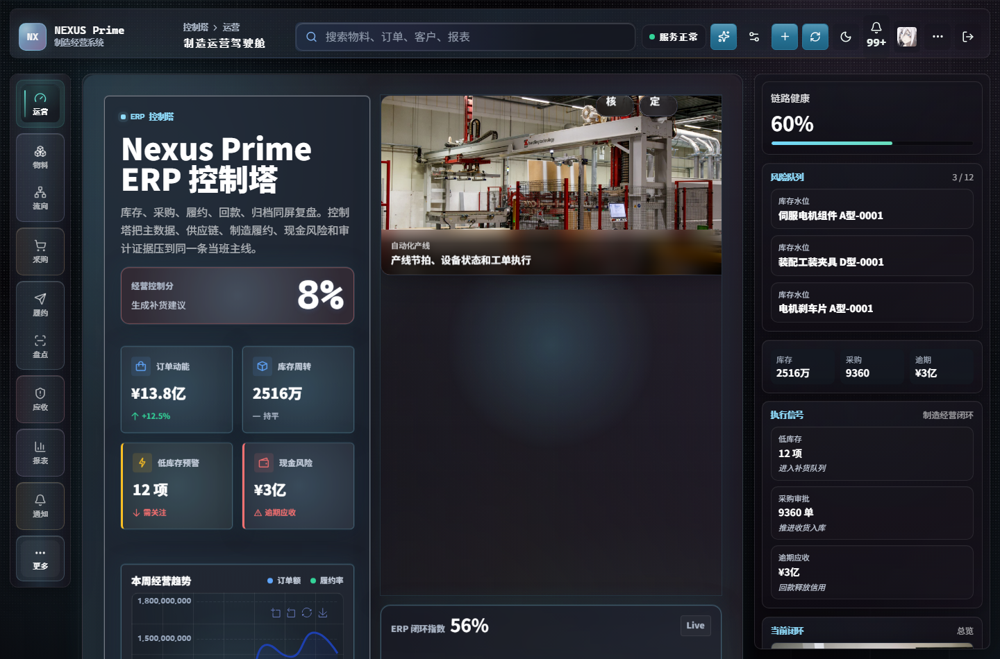

功能点：
- 查看经营控制分和核心 KPI
- 进入库存、采购、销售、财务等业务闭环
- 查看当班待办、风险提示和趋势图

升级说明：运营域强调经营指标、任务异常、产能和设备状态，目标是把管理者每天先看的信息放在同一层。页面不再用零散跳转块，而是以态势图、风险队列和执行列表组织。本页按照“上方真实图和关键图表、中部交互报表、下方表单和分页操作台”的原则组织，避免无意义跳转方框和页面内多套入口竞争。

### 2. 经营指标中心

- 路由：`/app/metrics`
- 桌面截图：`docs/images/final/pages/desktop-light-luxury-metrics.png`（亮色系统）
- 移动截图：`docs/images/final/pages/mobile-light-luxury-metrics.png`
- 页面定位：经营指标中心用于展示业务健康度、营收趋势、库存效率和现金流风险。
- 主要数据：经营指标、库存水位、销售和财务汇总。
- 主要接口：`analytics/executive`
- 代码关联：`executive-metrics.page.ts + analytics/executive`

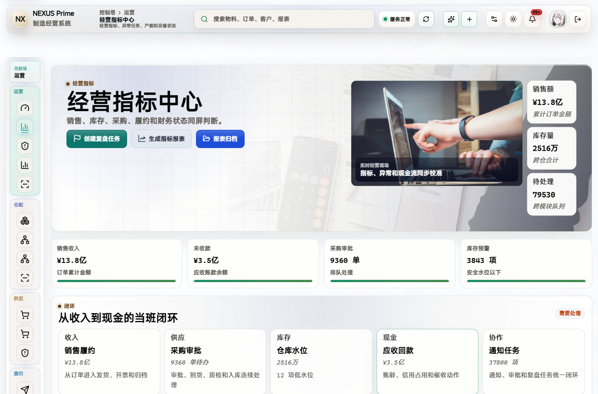

功能点：
- 查看核心经营指标
- 对比多维度图表
- 识别异常指标并进入相关业务页

升级说明：运营域强调经营指标、任务异常、产能和设备状态，目标是把管理者每天先看的信息放在同一层。页面不再用零散跳转块，而是以态势图、风险队列和执行列表组织。本页按照“上方真实图和关键图表、中部交互报表、下方表单和分页操作台”的原则组织，避免无意义跳转方框和页面内多套入口竞争。

### 3. 任务异常中心

- 路由：`/app/tasks`
- 桌面截图：`docs/images/final/pages/desktop-dark-cockpit-tasks.png`（深色驾驶舱）
- 移动截图：`docs/images/final/pages/mobile-light-luxury-tasks.png`
- 页面定位：任务异常中心把超期、堵点、审批、库存和质量异常集中到统一队列。
- 主要数据：待办、异常、流程任务和通知。
- 主要接口：`operations/todo, operations/exceptions, notifications`
- 代码关联：`operations-tasks.page.ts + operations/todo + notifications`

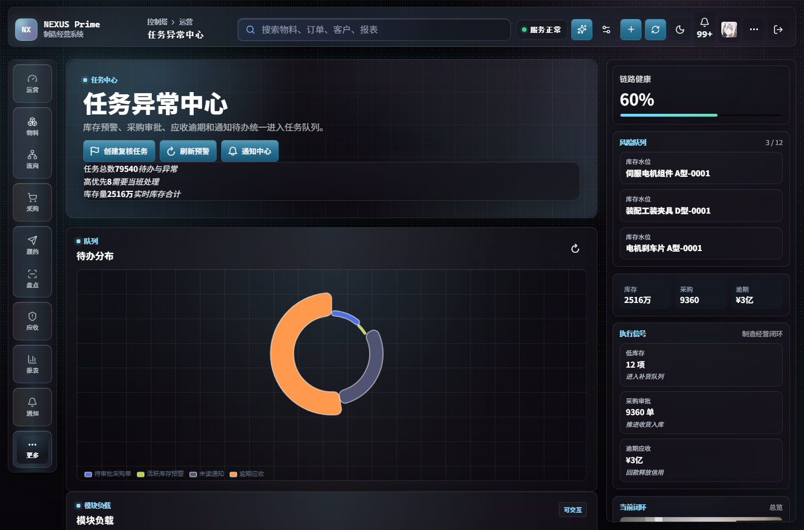

功能点：
- 查看异常任务
- 按状态和优先级识别风险
- 从异常跳转到具体业务对象

升级说明：运营域强调经营指标、任务异常、产能和设备状态，目标是把管理者每天先看的信息放在同一层。页面不再用零散跳转块，而是以态势图、风险队列和执行列表组织。本页按照“上方真实图和关键图表、中部交互报表、下方表单和分页操作台”的原则组织，避免无意义跳转方框和页面内多套入口竞争。

### 4. 物料库存图谱

- 路由：`/app/inventory/products`
- 桌面截图：`docs/images/final/pages/desktop-light-luxury-inventory-products.png`（亮色系统）
- 移动截图：`docs/images/final/pages/mobile-light-luxury-inventory-products.png`
- 页面定位：物料库存图谱管理产品主数据、分类、供应商和库存关联。
- 主要数据：商品、分类、供应商、标签和库存数量。
- 主要接口：`products, categories, partners, inventory`
- 代码关联：`ResourceWorkbench + products 资源配置 + materials.page.ts`

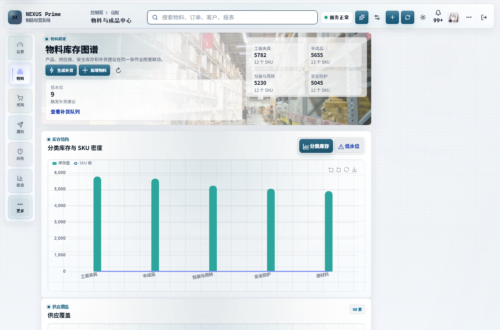

功能点：
- 查看物料清单
- 搜索筛选商品
- 维护物料属性并查看库存摘要

升级说明：仓配域围绕物料、库存、仓库、库位、扫码和盘点。上方看库存真实场景和流向，中间看交互报表，下方用统一操作台处理库存变动、分页和记录检查。本页按照“上方真实图和关键图表、中部交互报表、下方表单和分页操作台”的原则组织，避免无意义跳转方框和页面内多套入口竞争。

### 5. 仓配流向图

- 路由：`/app/inventory/stock`
- 桌面截图：`docs/images/final/pages/desktop-dark-cockpit-inventory-stock.png`（深色驾驶舱）
- 移动截图：`docs/images/final/pages/mobile-light-luxury-inventory-stock.png`
- 页面定位：仓配流向图展示仓库、库存数量、调拨流向和库存动作。
- 主要数据：仓库、库存数量、库存日志、库存移动和预警。
- 主要接口：`stocks, warehouses, inventory/adjust`
- 代码关联：`ResourceWorkbench + inventory/adjust + warehouse-flow.page.ts`

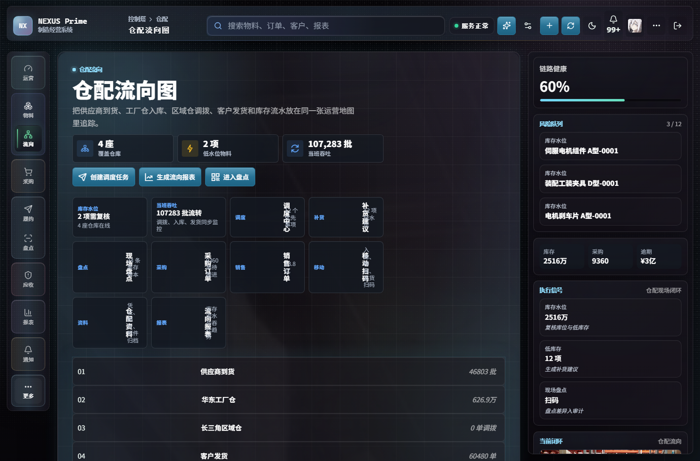

功能点：
- 查看仓库和库存流向
- 查看库存明细和分页
- 执行库存调整和仓配调度

升级说明：仓配域围绕物料、库存、仓库、库位、扫码和盘点。上方看库存真实场景和流向，中间看交互报表，下方用统一操作台处理库存变动、分页和记录检查。本页按照“上方真实图和关键图表、中部交互报表、下方表单和分页操作台”的原则组织，避免无意义跳转方框和页面内多套入口竞争。

### 6. 采购补货建议

- 路由：`/app/inventory/replenishment`
- 桌面截图：`docs/images/final/pages/desktop-light-luxury-inventory-replenishment.png`（亮色系统）
- 移动截图：`docs/images/final/pages/mobile-light-luxury-inventory-replenishment.png`
- 页面定位：采购补货建议把低库存商品、建议数量、供应商和采购转化关系放在同一页。
- 主要数据：补货建议、商品、仓库、供应商和采购单。
- 主要接口：`inventory/replenishment-suggestions`
- 代码关联：`ResourceWorkbench + replenishment-suggestions + replenishment.page.ts`

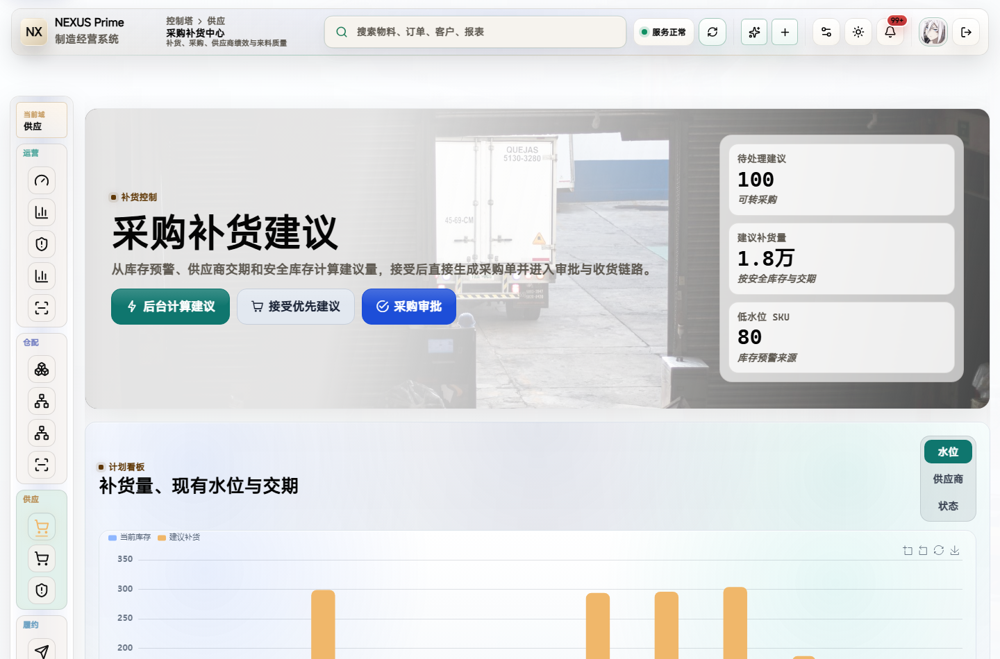

功能点：
- 生成补货建议
- 接受或忽略建议
- 跟踪建议到采购订单的转化

升级说明：供应域连接补货建议、采购订单、供应商绩效和质量检验。核心逻辑是从低库存到采购、从采购到收货、从收货结果到供应商评分。本页按照“上方真实图和关键图表、中部交互报表、下方表单和分页操作台”的原则组织，避免无意义跳转方框和页面内多套入口竞争。

### 7. 客户窗口与发货调度台

- 路由：`/app/sales/orders`
- 桌面截图：`docs/images/final/pages/desktop-dark-cockpit-sales-orders.png`（深色驾驶舱）
- 移动截图：`docs/images/final/pages/mobile-light-luxury-sales-orders.png`
- 页面定位：销售履约中心管理客户订单、发货状态、销售人员和应收联动。
- 主要数据：销售订单、订单明细、客户、销售员、应收。
- 主要接口：`sales/orders, sales/orders/:id/transition`
- 代码关联：`ResourceWorkbench + sales/orders transition + fulfillment.page.ts`

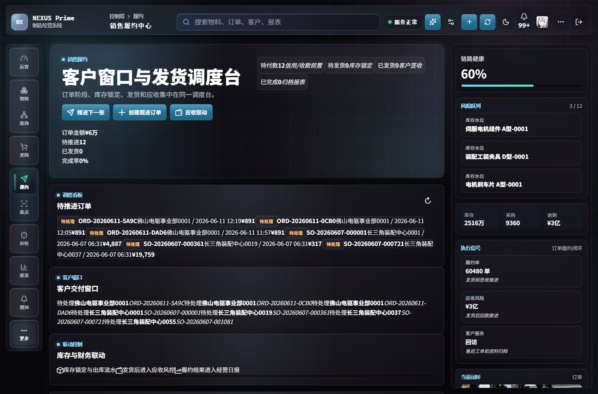

功能点：
- 创建和查看销售订单
- 推进订单状态
- 查看客户和商品明细

升级说明：履约域连接客户、销售订单、仓配调度和售后服务。页面重点不是孤立订单表，而是展示客户价值、履约阶段、发货动作和服务闭环。本页按照“上方真实图和关键图表、中部交互报表、下方表单和分页操作台”的原则组织，避免无意义跳转方框和页面内多套入口竞争。

### 8. 采购协同控制台

- 路由：`/app/procurement/orders`
- 桌面截图：`docs/images/final/pages/desktop-light-luxury-procurement-orders.png`（亮色系统）
- 移动截图：`docs/images/final/pages/mobile-light-luxury-procurement-orders.png`
- 页面定位：采购协同控制台覆盖采购创建、提交、审批、收货和供应商承诺。
- 主要数据：采购订单、采购明细、供应商、仓库和补货建议。
- 主要接口：`procurement/orders, operations/procurement-control`
- 代码关联：`ResourceWorkbench + procurement workflow + procurement.page.ts`

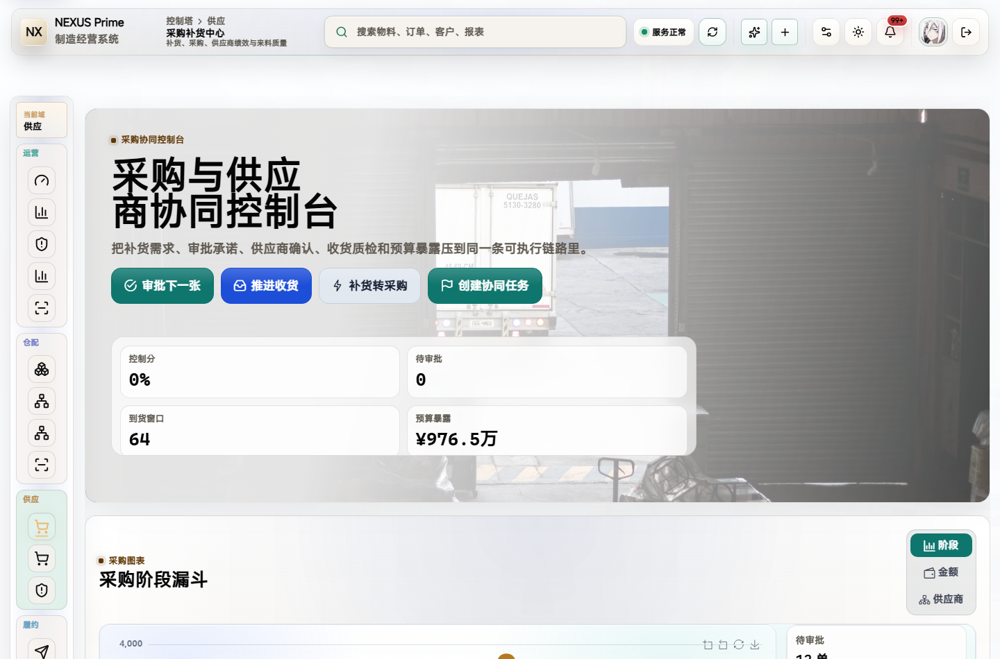

功能点：
- 查看采购订单
- 提交审批和批准
- 登记收货并跟踪采购进度

升级说明：供应域连接补货建议、采购订单、供应商绩效和质量检验。核心逻辑是从低库存到采购、从采购到收货、从收货结果到供应商评分。本页按照“上方真实图和关键图表、中部交互报表、下方表单和分页操作台”的原则组织，避免无意义跳转方框和页面内多套入口竞争。

### 9. 供应商协同

- 路由：`/app/suppliers/performance`
- 桌面截图：`docs/images/final/pages/desktop-dark-cockpit-suppliers-performance.png`（深色驾驶舱）
- 移动截图：`docs/images/final/pages/mobile-light-luxury-suppliers-performance.png`
- 页面定位：供应商协同网络评估供应商交付、质量、信用和待办采购风险。
- 主要数据：供应商绩效、伙伴档案、采购订单和质量指标。
- 主要接口：`suppliers-performance, partners`
- 代码关联：`supplier-performance.page.ts + supplier_performance 模型`

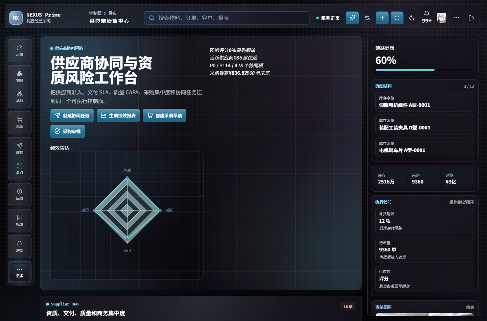

功能点：
- 查看供应商绩效
- 识别延期和质量风险
- 联动采购订单和补货任务

升级说明：供应域连接补货建议、采购订单、供应商绩效和质量检验。核心逻辑是从低库存到采购、从采购到收货、从收货结果到供应商评分。本页按照“上方真实图和关键图表、中部交互报表、下方表单和分页操作台”的原则组织，避免无意义跳转方框和页面内多套入口竞争。

### 10. 仓配调度中心

- 路由：`/app/dispatch`
- 桌面截图：`docs/images/final/pages/desktop-light-luxury-dispatch.png`（亮色系统）
- 移动截图：`docs/images/final/pages/mobile-light-luxury-dispatch.png`
- 页面定位：仓配调度中心聚焦仓库负载、出入库节奏和调度任务。
- 主要数据：仓库、库存流水、任务队列和异常提示。
- 主要接口：`operations/dispatch, stocks, stock-logs`
- 代码关联：`dispatch-center.page.ts + operations/dispatch`

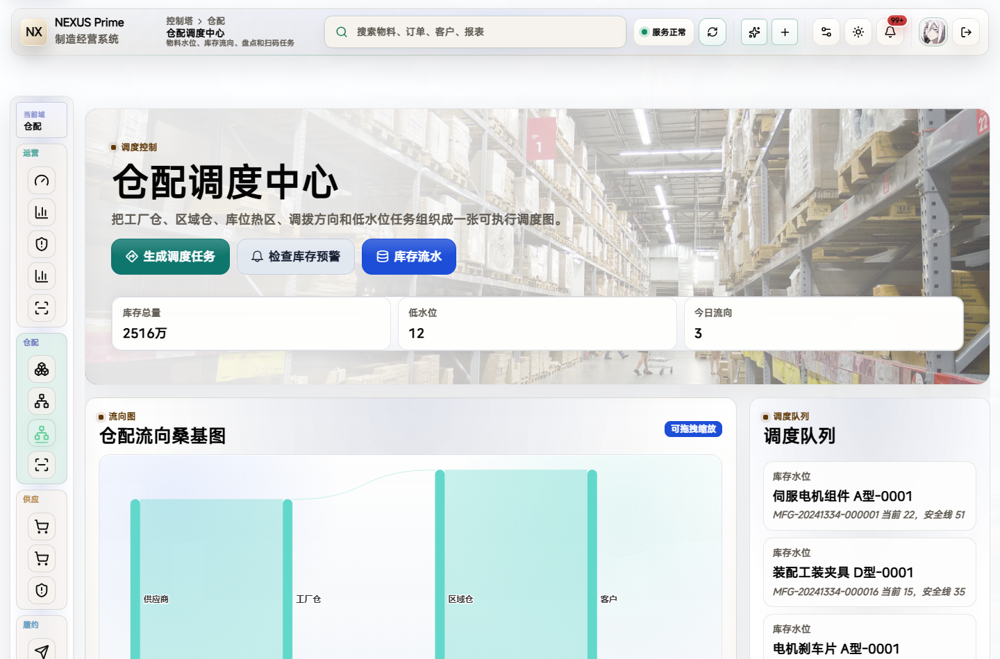

功能点：
- 查看仓配任务
- 识别拥堵仓库
- 跟踪执行队列和调度建议

升级说明：仓配域围绕物料、库存、仓库、库位、扫码和盘点。上方看库存真实场景和流向，中间看交互报表，下方用统一操作台处理库存变动、分页和记录检查。本页按照“上方真实图和关键图表、中部交互报表、下方表单和分页操作台”的原则组织，避免无意义跳转方框和页面内多套入口竞争。

### 11. 数据质量中心

- 路由：`/app/data-quality`
- 桌面截图：`docs/images/final/pages/desktop-dark-cockpit-data-quality.png`（深色驾驶舱）
- 移动截图：`docs/images/final/pages/mobile-light-luxury-data-quality.png`
- 页面定位：数据质量中心用于检查主数据完整性、重复记录和业务字段异常。
- 主要数据：商品、伙伴、订单、库存和审计检查结果。
- 主要接口：`operations/data-quality`
- 代码关联：`data-quality.page.ts + data quality jobs`

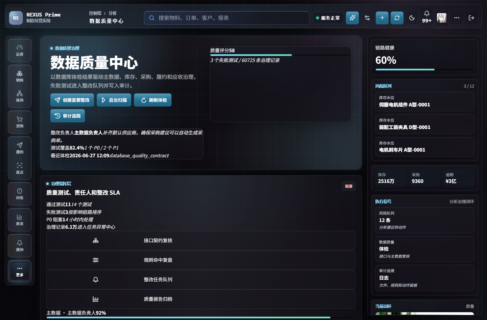

功能点：
- 查看数据质量评分
- 定位缺失字段
- 跟踪修复任务

升级说明：分析域覆盖报表、规则、数据质量、集成和 AI。它把系统状态、数据可信度和经营建议放到一套分析流程里。本页按照“上方真实图和关键图表、中部交互报表、下方表单和分页操作台”的原则组织，避免无意义跳转方框和页面内多套入口竞争。

### 12. 质量检验中心

- 路由：`/app/quality`
- 桌面截图：`docs/images/final/pages/desktop-light-luxury-quality.png`（亮色系统）
- 移动截图：`docs/images/final/pages/mobile-light-luxury-quality.png`
- 页面定位：质量检验中心管理检验批、质量问题、处置动作和质量趋势。
- 主要数据：质量任务、采购、供应商、商品和异常记录。
- 主要接口：`operations/quality-inspection`
- 代码关联：`quality-inspection.page.ts + operations/quality-inspection`

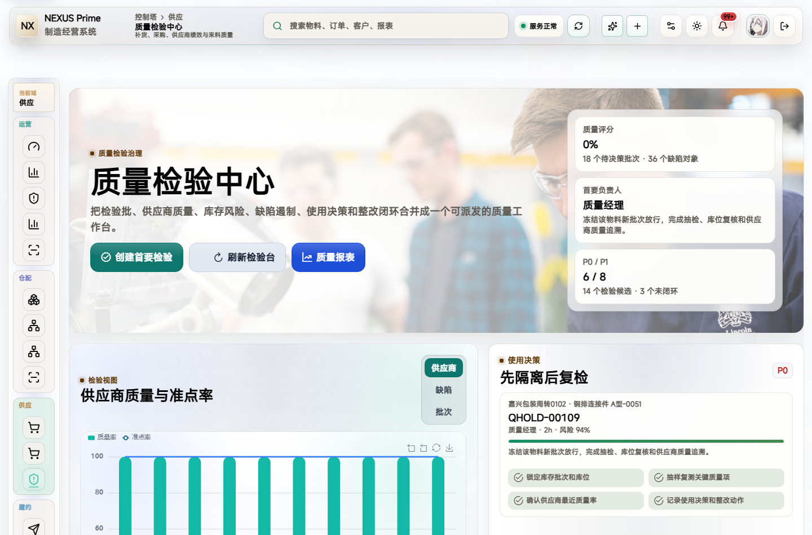

功能点：
- 查看检验任务
- 记录质量处置
- 识别供应商和产品质量风险

升级说明：供应域连接补货建议、采购订单、供应商绩效和质量检验。核心逻辑是从低库存到采购、从采购到收货、从收货结果到供应商评分。本页按照“上方真实图和关键图表、中部交互报表、下方表单和分页操作台”的原则组织，避免无意义跳转方框和页面内多套入口竞争。

### 13. 客户经营中心

- 路由：`/app/customers`
- 桌面截图：`docs/images/final/pages/desktop-dark-cockpit-customers.png`（深色驾驶舱）
- 移动截图：`docs/images/final/pages/mobile-light-luxury-customers.png`
- 页面定位：客户经营中心把客户档案、交易贡献、风险和服务动作合并展示。
- 主要数据：客户伙伴、订单、应收、信用和服务记录。
- 主要接口：`partners, sales/orders, finance/credits`
- 代码关联：`ResourceWorkbench + partners 资源配置 + customer-operations.page.ts`

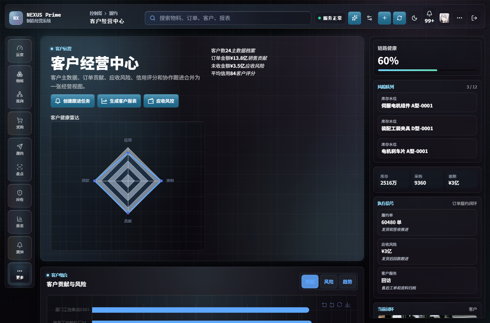

功能点：
- 查看客户清单
- 识别高价值和高风险客户
- 进入订单、应收和信用动作

升级说明：履约域连接客户、销售订单、仓配调度和售后服务。页面重点不是孤立订单表，而是展示客户价值、履约阶段、发货动作和服务闭环。本页按照“上方真实图和关键图表、中部交互报表、下方表单和分页操作台”的原则组织，避免无意义跳转方框和页面内多套入口竞争。

### 14. 产能计划中心

- 路由：`/app/capacity`
- 桌面截图：`docs/images/final/pages/desktop-light-luxury-capacity.png`（亮色系统）
- 移动截图：`docs/images/final/pages/mobile-light-luxury-capacity.png`
- 页面定位：产能计划中心用于查看产能负载、瓶颈工序、齐套风险和排产建议。
- 主要数据：产能计划、设备、采购、库存和任务队列。
- 主要接口：`operations/capacity, operations/capacity/review`
- 代码关联：`capacity-planning.page.ts + operations/capacity`

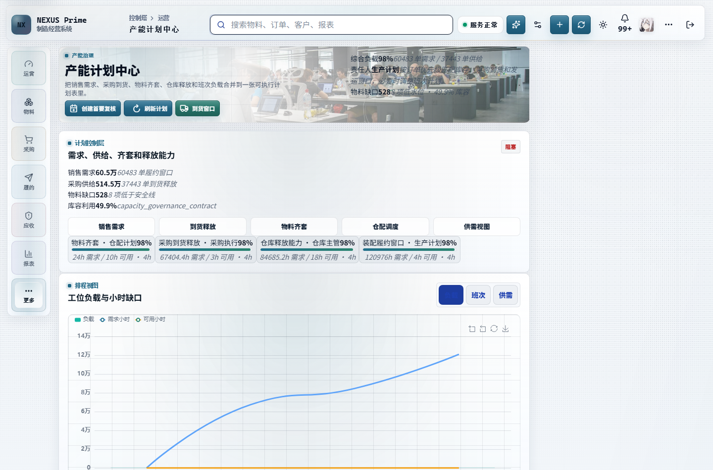

功能点：
- 查看产能负载
- 发起产能复核
- 识别齐套和设备瓶颈

升级说明：运营域强调经营指标、任务异常、产能和设备状态，目标是把管理者每天先看的信息放在同一层。页面不再用零散跳转块，而是以态势图、风险队列和执行列表组织。本页按照“上方真实图和关键图表、中部交互报表、下方表单和分页操作台”的原则组织，避免无意义跳转方框和页面内多套入口竞争。

### 15. 设备维护中心

- 路由：`/app/maintenance`
- 桌面截图：`docs/images/final/pages/desktop-dark-cockpit-maintenance.png`（深色驾驶舱）
- 移动截图：`docs/images/final/pages/mobile-light-luxury-maintenance.png`
- 页面定位：设备维护中心用于管理设备状态、预防维护、故障工单和可靠性指标。
- 主要数据：设备、维护工单、产能和质量异常。
- 主要接口：`operations/maintenance, operations/maintenance-workorder`
- 代码关联：`maintenance.page.ts + operations/maintenance`

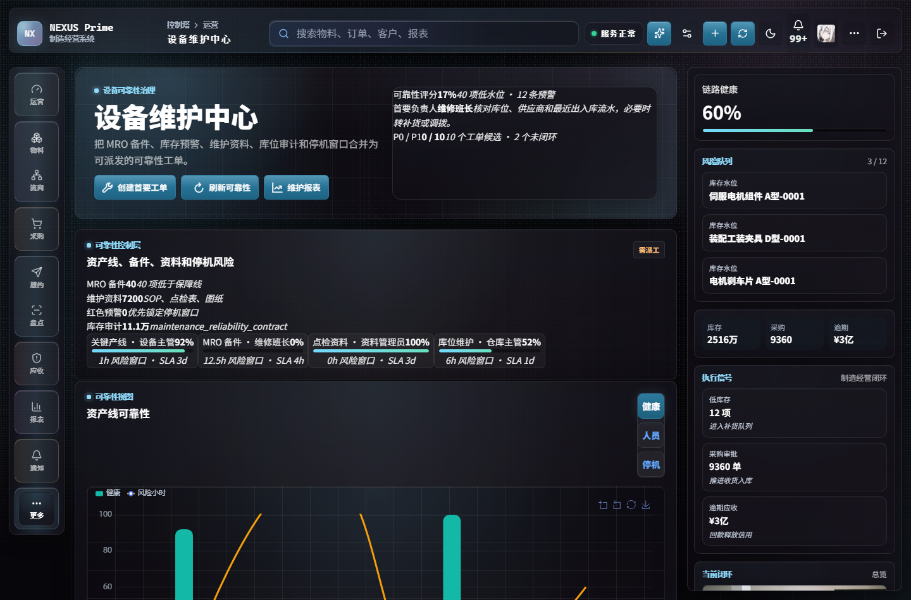

功能点：
- 查看设备健康
- 创建维护工单
- 跟踪维修队列和停机影响

升级说明：运营域强调经营指标、任务异常、产能和设备状态，目标是把管理者每天先看的信息放在同一层。页面不再用零散跳转块，而是以态势图、风险队列和执行列表组织。本页按照“上方真实图和关键图表、中部交互报表、下方表单和分页操作台”的原则组织，避免无意义跳转方框和页面内多套入口竞争。

### 16. 合同回款中心

- 路由：`/app/contracts`
- 桌面截图：`docs/images/final/pages/desktop-light-luxury-contracts.png`（亮色系统）
- 移动截图：`docs/images/final/pages/mobile-light-luxury-contracts.png`
- 页面定位：合同回款中心连接合同、订单、应收和回款风险。
- 主要数据：合同、销售订单、应收账款、收款记录和客户。
- 主要接口：`contracts, finance/receivables`
- 代码关联：`contract-collection.page.ts + finance/receivables`

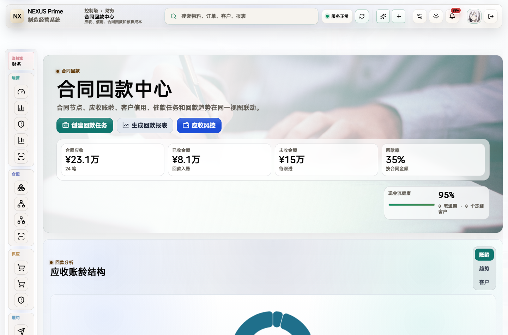

功能点：
- 查看合同和回款节点
- 识别逾期风险
- 联动财务收款和客户信用

升级说明：财务域覆盖应收、信用、合同和预算成本。它用账龄、额度、回款和成本偏差表达经营风险，让财务动作能回到订单、客户和合同。本页按照“上方真实图和关键图表、中部交互报表、下方表单和分页操作台”的原则组织，避免无意义跳转方框和页面内多套入口竞争。

### 17. 售后服务中心

- 路由：`/app/service`
- 桌面截图：`docs/images/final/pages/desktop-dark-cockpit-service.png`（深色驾驶舱）
- 移动截图：`docs/images/final/pages/mobile-light-luxury-service.png`
- 页面定位：售后服务中心管理客户服务、问题处理和履约后的反馈闭环。
- 主要数据：客户、订单、售后工单、质量问题和通知。
- 主要接口：`operations/service, partners`
- 代码关联：`service-workorders.page.ts + operations/service`

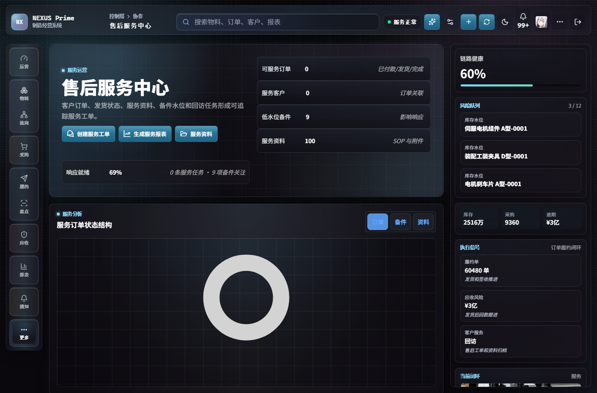

功能点：
- 查看服务工单
- 识别客户反馈风险
- 联动客户、订单和质量页面

升级说明：履约域连接客户、销售订单、仓配调度和售后服务。页面重点不是孤立订单表，而是展示客户价值、履约阶段、发货动作和服务闭环。本页按照“上方真实图和关键图表、中部交互报表、下方表单和分页操作台”的原则组织，避免无意义跳转方框和页面内多套入口竞争。

### 18. 规则引擎中心

- 路由：`/app/rules`
- 桌面截图：`docs/images/final/pages/desktop-light-luxury-rules.png`（亮色系统）
- 移动截图：`docs/images/final/pages/mobile-light-luxury-rules.png`
- 页面定位：规则引擎中心展示预警、审批、补货和报表规则的运行状态。
- 主要数据：规则、通知、报表订阅、补货建议和审计记录。
- 主要接口：`rules, notifications, report-subscriptions`
- 代码关联：`rules-engine.page.ts + rules/notifications/report-subscriptions`

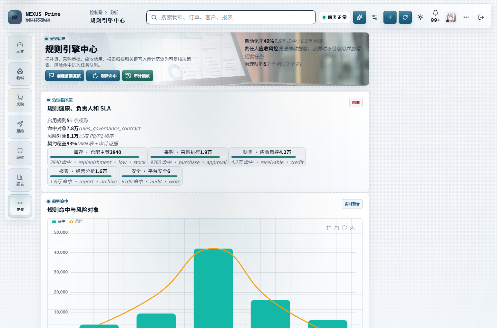

功能点：
- 查看规则命中
- 管理规则状态
- 追踪规则带来的任务和通知

升级说明：分析域覆盖报表、规则、数据质量、集成和 AI。它把系统状态、数据可信度和经营建议放到一套分析流程里。本页按照“上方真实图和关键图表、中部交互报表、下方表单和分页操作台”的原则组织，避免无意义跳转方框和页面内多套入口竞争。

### 19. 集成监控中心

- 路由：`/app/integrations`
- 桌面截图：`docs/images/final/pages/desktop-dark-cockpit-integrations.png`（深色驾驶舱）
- 移动截图：`docs/images/final/pages/mobile-light-luxury-integrations.png`
- 页面定位：集成监控中心用于查看外部系统、任务队列和数据同步状态。
- 主要数据：后台任务、领域事件、集成状态和错误摘要。
- 主要接口：`integrations, background-jobs, domain-events`
- 代码关联：`integration-monitor.page.ts + background_jobs + domain_events`

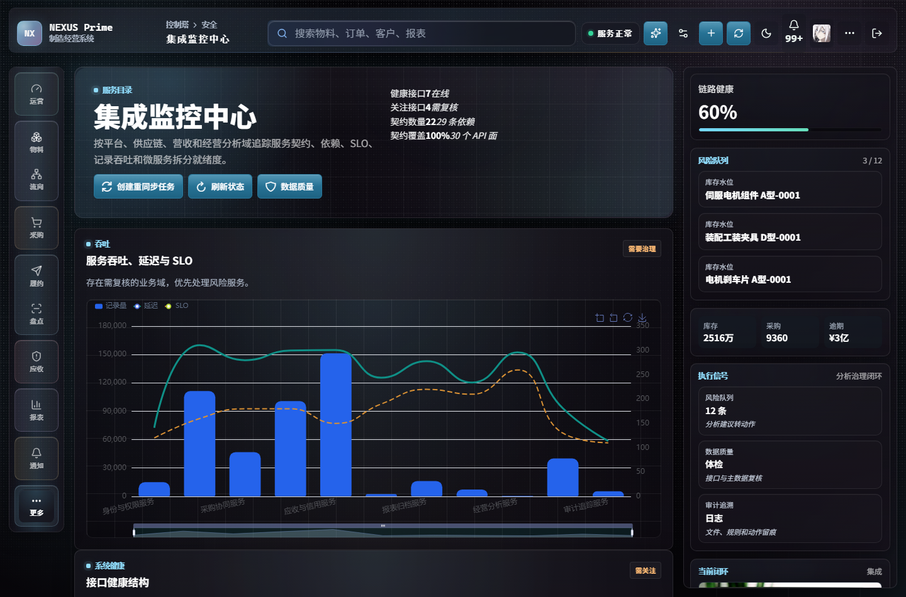

功能点：
- 查看集成健康
- 识别失败同步
- 跟踪后台任务和领域事件

升级说明：分析域覆盖报表、规则、数据质量、集成和 AI。它把系统状态、数据可信度和经营建议放到一套分析流程里。本页按照“上方真实图和关键图表、中部交互报表、下方表单和分页操作台”的原则组织，避免无意义跳转方框和页面内多套入口竞争。

### 20. 预算成本中心

- 路由：`/app/budget`
- 桌面截图：`docs/images/final/pages/desktop-light-luxury-budget.png`（亮色系统）
- 移动截图：`docs/images/final/pages/mobile-light-luxury-budget.png`
- 页面定位：预算成本中心管理采购成本、库存成本、预算偏差和复核动作。
- 主要数据：采购、库存、财务、预算指标和异常任务。
- 主要接口：`operations/costs, operations/costs/review`
- 代码关联：`budget-cost.page.ts + operations/costs`

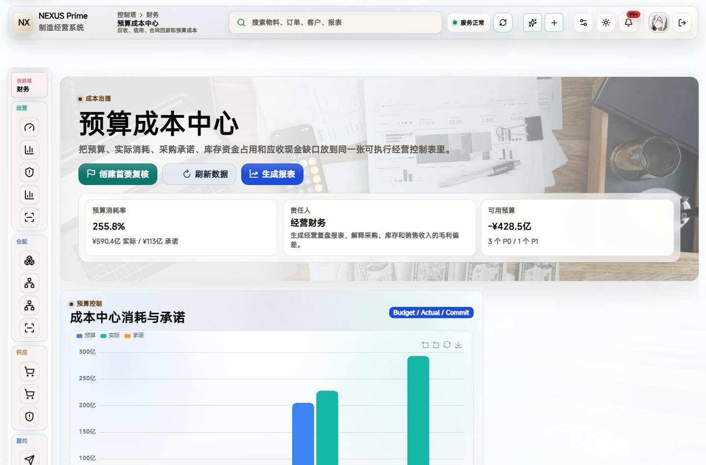

功能点：
- 查看预算执行
- 识别成本偏差
- 发起预算复核

升级说明：财务域覆盖应收、信用、合同和预算成本。它用账龄、额度、回款和成本偏差表达经营风险，让财务动作能回到订单、客户和合同。本页按照“上方真实图和关键图表、中部交互报表、下方表单和分页操作台”的原则组织，避免无意义跳转方框和页面内多套入口竞争。

### 21. 移动扫码终端

- 路由：`/app/mobile-terminal`
- 桌面截图：`docs/images/final/pages/desktop-dark-cockpit-mobile-terminal.png`（深色驾驶舱）
- 移动截图：`docs/images/final/pages/mobile-light-luxury-mobile-terminal.png`
- 页面定位：移动扫码终端模拟仓库现场扫码、拣货、上架、盘点和执行记录。
- 主要数据：移动任务、库存、仓库、盘点和通知。
- 主要接口：`operations/mobile-terminal, operations/mobile-terminal/task`
- 代码关联：`mobile-terminal.page.ts + operations/mobile-terminal`

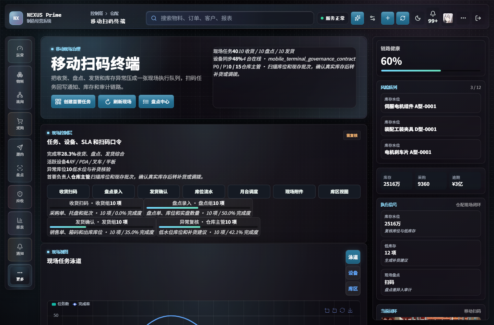

功能点：
- 查看扫码任务
- 创建现场任务
- 跟踪执行状态和移动端适配

升级说明：仓配域围绕物料、库存、仓库、库位、扫码和盘点。上方看库存真实场景和流向，中间看交互报表，下方用统一操作台处理库存变动、分页和记录检查。本页按照“上方真实图和关键图表、中部交互报表、下方表单和分页操作台”的原则组织，避免无意义跳转方框和页面内多套入口竞争。

### 22. 账龄风险墙

- 路由：`/app/finance/receivables`
- 桌面截图：`docs/images/final/pages/desktop-light-luxury-finance-receivables.png`（亮色系统）
- 移动截图：`docs/images/final/pages/mobile-light-luxury-finance-receivables.png`
- 页面定位：账龄风险墙用于查看应收账款、逾期天数、账龄分布和催收动作。
- 主要数据：应收、收款、客户、销售订单和账龄统计。
- 主要接口：`finance/receivables, finance/receivables/aging`
- 代码关联：`ResourceWorkbench + receivables + payment action`

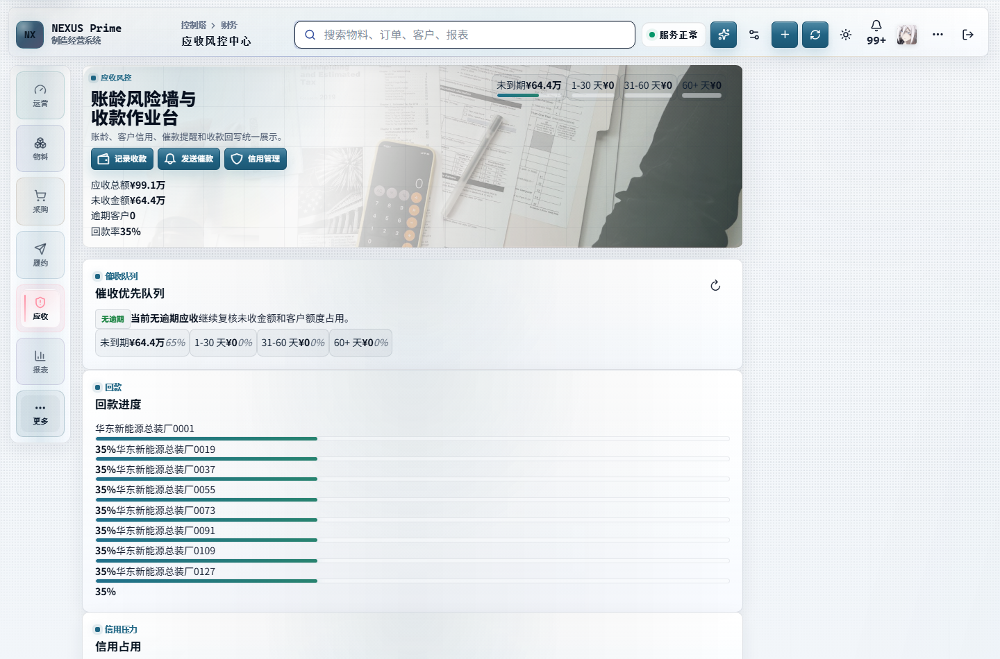

功能点：
- 查看应收列表
- 登记收款
- 分析账龄风险和客户风险

升级说明：财务域覆盖应收、信用、合同和预算成本。它用账龄、额度、回款和成本偏差表达经营风险，让财务动作能回到订单、客户和合同。本页按照“上方真实图和关键图表、中部交互报表、下方表单和分页操作台”的原则组织，避免无意义跳转方框和页面内多套入口竞争。

### 23. 客户信用中心

- 路由：`/app/finance/credits`
- 桌面截图：`docs/images/final/pages/desktop-dark-cockpit-finance-credits.png`（深色驾驶舱）
- 移动截图：`docs/images/final/pages/mobile-light-luxury-finance-credits.png`
- 页面定位：客户信用中心管理信用额度、可用额度、冻结状态和客户风险。
- 主要数据：客户信用、客户、订单和应收。
- 主要接口：`finance/credits, finance/credits/:id/freeze`
- 代码关联：`ResourceWorkbench + credits + freeze/unfreeze action`

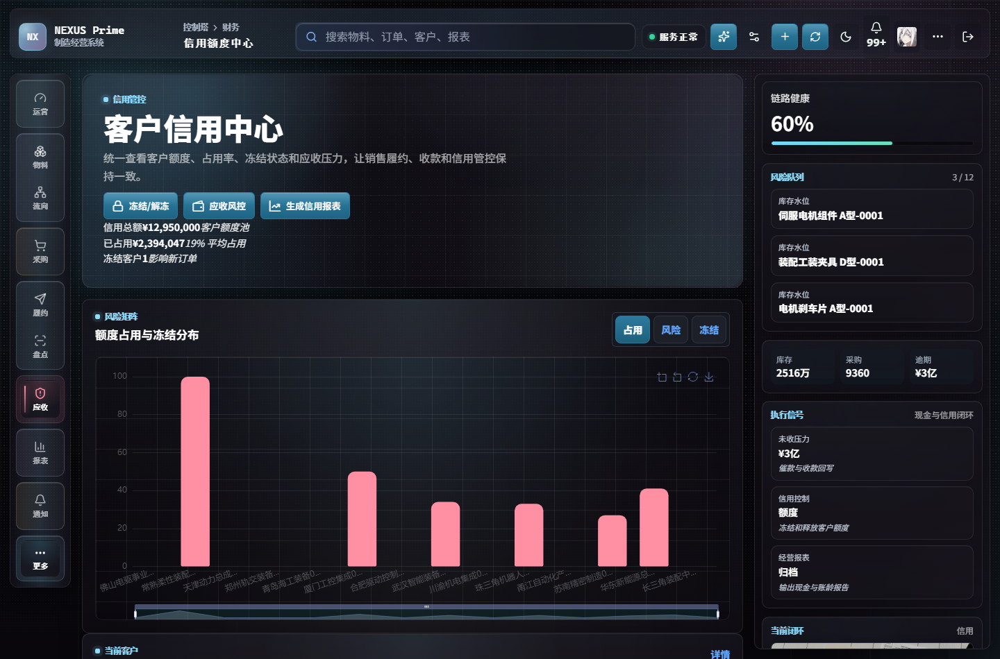

功能点：
- 查看客户信用
- 冻结或释放信用
- 联动订单和应收风险

升级说明：财务域覆盖应收、信用、合同和预算成本。它用账龄、额度、回款和成本偏差表达经营风险，让财务动作能回到订单、客户和合同。本页按照“上方真实图和关键图表、中部交互报表、下方表单和分页操作台”的原则组织，避免无意义跳转方框和页面内多套入口竞争。

### 24. 库存盘点中心

- 路由：`/app/stocktakes`
- 桌面截图：`docs/images/final/pages/desktop-light-luxury-stocktakes.png`（亮色系统）
- 移动截图：`docs/images/final/pages/mobile-light-luxury-stocktakes.png`
- 页面定位：库存盘点中心管理盘点单、盘点明细、差异和库存修正。
- 主要数据：盘点单、盘点明细、仓库、商品和库存日志。
- 主要接口：`stocktakes, stocktakes/create, stocktakes/:id/complete`
- 代码关联：`ResourceWorkbench + stocktakes + stocktake actions`

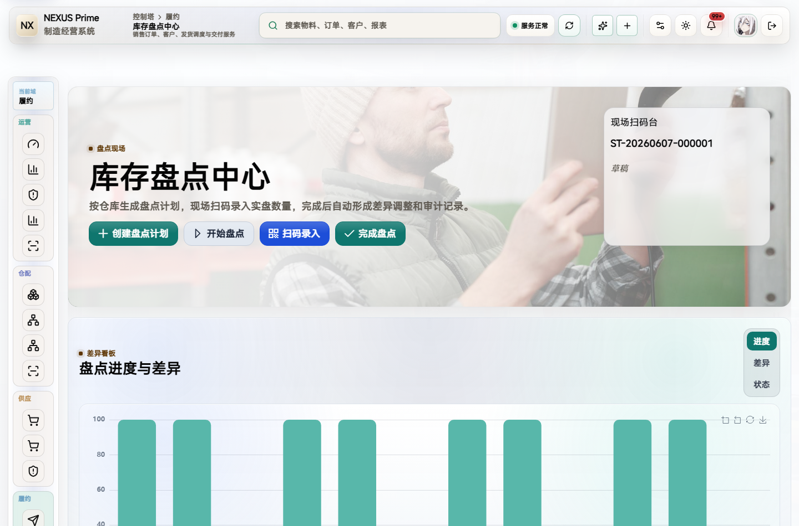

功能点：
- 创建盘点
- 启动和完成盘点
- 录入差异并查看调整影响

升级说明：仓配域围绕物料、库存、仓库、库位、扫码和盘点。上方看库存真实场景和流向，中间看交互报表，下方用统一操作台处理库存变动、分页和记录检查。本页按照“上方真实图和关键图表、中部交互报表、下方表单和分页操作台”的原则组织，避免无意义跳转方框和页面内多套入口竞争。

### 25. 报表工作室

- 路由：`/app/reports`
- 桌面截图：`docs/images/final/pages/desktop-dark-cockpit-reports.png`（深色驾驶舱）
- 移动截图：`docs/images/final/pages/mobile-light-luxury-reports.png`
- 页面定位：报表工作室用于生成、查看、订阅和下载经营报表。
- 主要数据：生成报表、报表订阅、经营指标和用户。
- 主要接口：`reports/generate, generated-reports, report-subscriptions`
- 代码关联：`ResourceWorkbench + generated-reports + reports/generate`

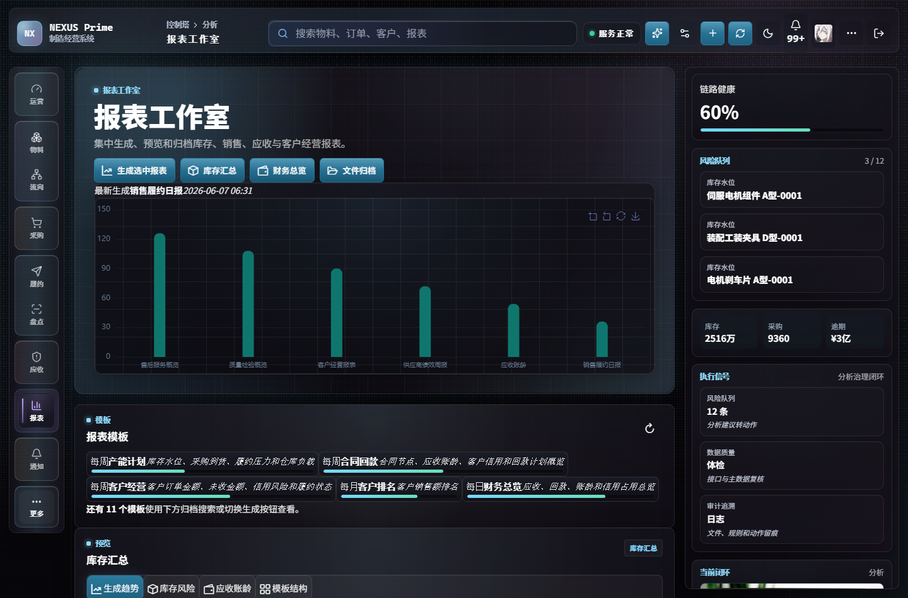

功能点：
- 生成报表
- 查看报表状态
- 管理报表订阅和历史

升级说明：分析域覆盖报表、规则、数据质量、集成和 AI。它把系统状态、数据可信度和经营建议放到一套分析流程里。本页按照“上方真实图和关键图表、中部交互报表、下方表单和分页操作台”的原则组织，避免无意义跳转方框和页面内多套入口竞争。

### 26. 文件资料库

- 路由：`/app/files`
- 桌面截图：`docs/images/final/pages/desktop-light-luxury-files.png`（亮色系统）
- 移动截图：`docs/images/final/pages/mobile-light-luxury-files.png`
- 页面定位：文件资料库管理业务附件、知识资料、下载和上传。
- 主要数据：附件、文章、上传人和业务引用。
- 主要接口：`files/upload, files/:id/download, attachments`
- 代码关联：`ResourceWorkbench + files/download/upload`

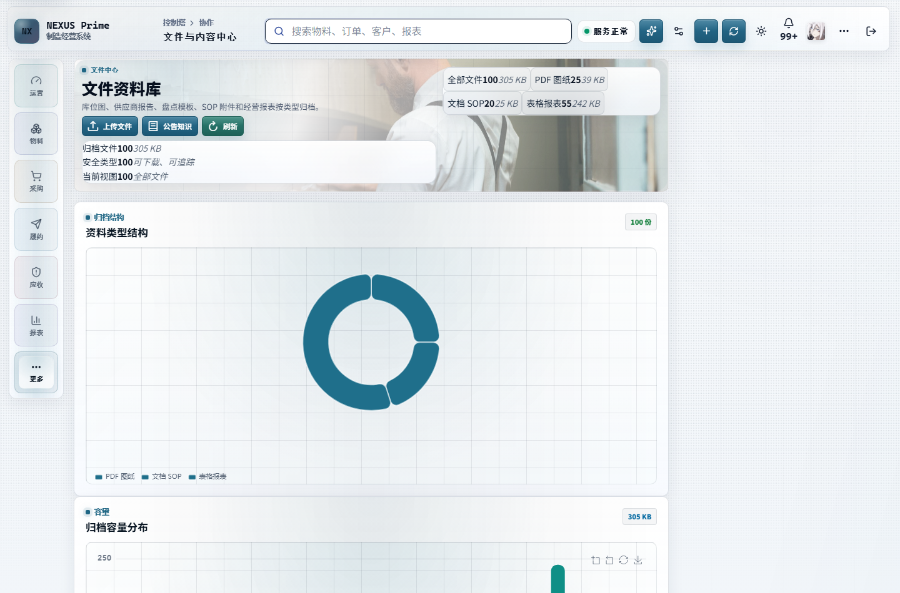

功能点：
- 上传文件
- 下载附件
- 按业务对象查看文件归档

升级说明：协作域覆盖通知、文件、公告和服务工单。它让业务结果能形成消息、资料、知识和后续动作，而不是停留在单页操作。本页按照“上方真实图和关键图表、中部交互报表、下方表单和分页操作台”的原则组织，避免无意义跳转方框和页面内多套入口竞争。

### 27. 公告与知识库

- 路由：`/app/content/articles`
- 桌面截图：`docs/images/final/pages/desktop-dark-cockpit-content-articles.png`（深色驾驶舱）
- 移动截图：`docs/images/final/pages/mobile-light-luxury-content-articles.png`
- 页面定位：公告与知识库发布企业公告、知识文章、评论和附件。
- 主要数据：文章、评论、附件、作者和审计记录。
- 主要接口：`articles, article-comments, attachments`
- 代码关联：`ResourceWorkbench + articles/comments/attachments`

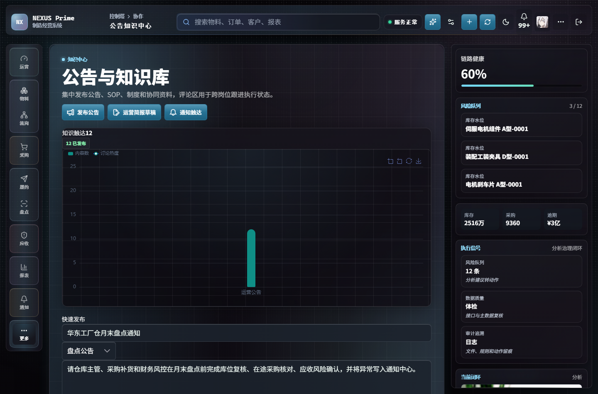

功能点：
- 查看文章
- 维护公告
- 评论和引用附件

升级说明：协作域覆盖通知、文件、公告和服务工单。它让业务结果能形成消息、资料、知识和后续动作，而不是停留在单页操作。本页按照“上方真实图和关键图表、中部交互报表、下方表单和分页操作台”的原则组织，避免无意义跳转方框和页面内多套入口竞争。

### 28. 系统安全中心

- 路由：`/app/system/users`
- 桌面截图：`docs/images/final/pages/desktop-light-luxury-system-users.png`（亮色系统）
- 移动截图：`docs/images/final/pages/mobile-light-luxury-system-users.png`
- 页面定位：系统安全中心管理账号、角色、部门、权限和账号状态。
- 主要数据：用户、角色、权限、部门和审计。
- 主要接口：`users, roles, permissions, departments`
- 代码关联：`ResourceWorkbench + users/roles/permissions`

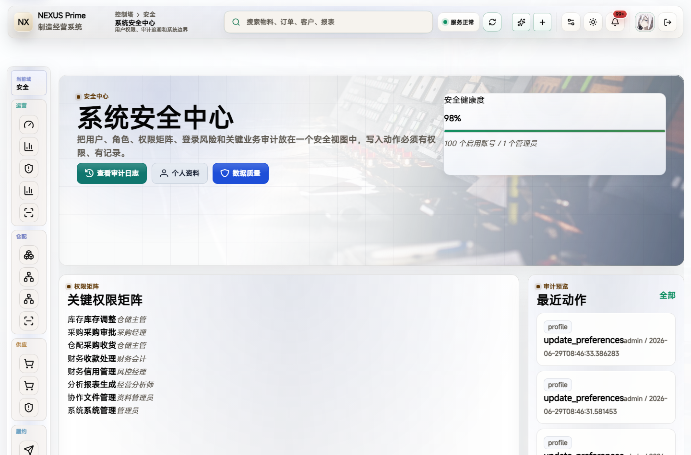

功能点：
- 查看用户列表
- 调整角色和账号状态
- 检查权限边界

升级说明：安全域覆盖用户、权限、审计和集成边界。核心是让谁做了什么、能做什么、何时做的都有清晰证据。本页按照“上方真实图和关键图表、中部交互报表、下方表单和分页操作台”的原则组织，避免无意义跳转方框和页面内多套入口竞争。

### 29. 审计日志

- 路由：`/app/system/audit`
- 桌面截图：`docs/images/final/pages/desktop-dark-cockpit-system-audit.png`（深色驾驶舱）
- 移动截图：`docs/images/final/pages/mobile-light-luxury-system-audit.png`
- 页面定位：审计日志页面集中展示登录、写入、审批、删除和系统动作留痕。
- 主要数据：审计日志、用户、模块、动作和请求上下文。
- 主要接口：`audit-logs`
- 代码关联：`ResourceWorkbench + audit-logs`

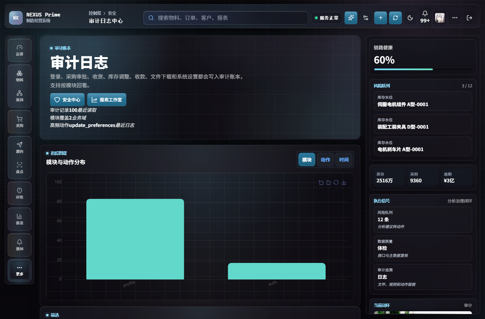

功能点：
- 查看审计日志
- 按用户和动作追踪
- 支撑问题回溯和课程验收

升级说明：安全域覆盖用户、权限、审计和集成边界。核心是让谁做了什么、能做什么、何时做的都有清晰证据。本页按照“上方真实图和关键图表、中部交互报表、下方表单和分页操作台”的原则组织，避免无意义跳转方框和页面内多套入口竞争。

### 30. 任务通知中心

- 路由：`/app/notifications`
- 桌面截图：`docs/images/final/pages/desktop-light-luxury-notifications.png`（亮色系统）
- 移动截图：`docs/images/final/pages/mobile-light-luxury-notifications.png`
- 页面定位：任务通知中心用于查看未读、已读、异常和业务提醒。
- 主要数据：系统通知、库存预警、任务事件和用户。
- 主要接口：`notifications, notifications/mark-read`
- 代码关联：`ResourceWorkbench + notifications/mark-read`

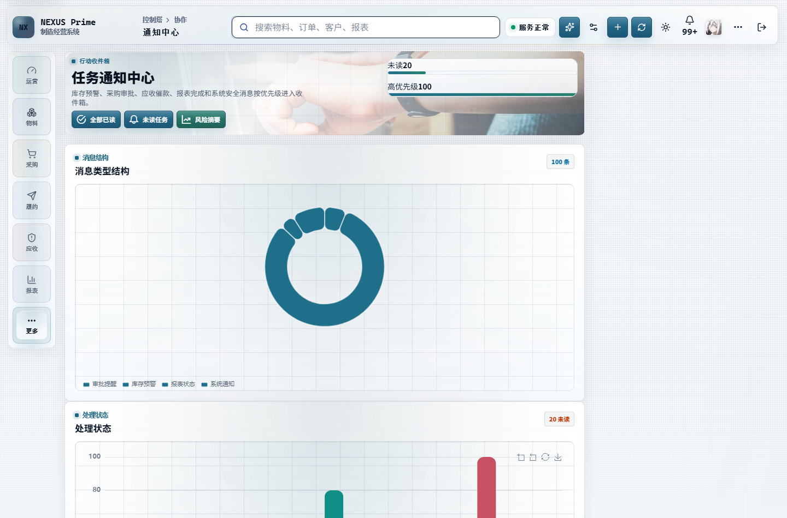

功能点：
- 查看通知
- 标记已读
- 从通知进入业务对象

升级说明：协作域覆盖通知、文件、公告和服务工单。它让业务结果能形成消息、资料、知识和后续动作，而不是停留在单页操作。本页按照“上方真实图和关键图表、中部交互报表、下方表单和分页操作台”的原则组织，避免无意义跳转方框和页面内多套入口竞争。

### 31. 经营分析台

- 路由：`/app/ai`
- 桌面截图：`docs/images/final/pages/desktop-dark-cockpit-ai.png`（深色驾驶舱）
- 移动截图：`docs/images/final/pages/mobile-light-luxury-ai.png`
- 页面定位：经营分析台提供 AI 对话、结构化诊断、经营建议和动作草稿。
- 主要数据：AI 会话、消息、经营指标、文档分块和动作草稿。
- 主要接口：`ai/chat, ai/analyze/structured, ai/diagnostics`
- 代码关联：`ResourceWorkbench + ai/chat + ai/analyze/structured`

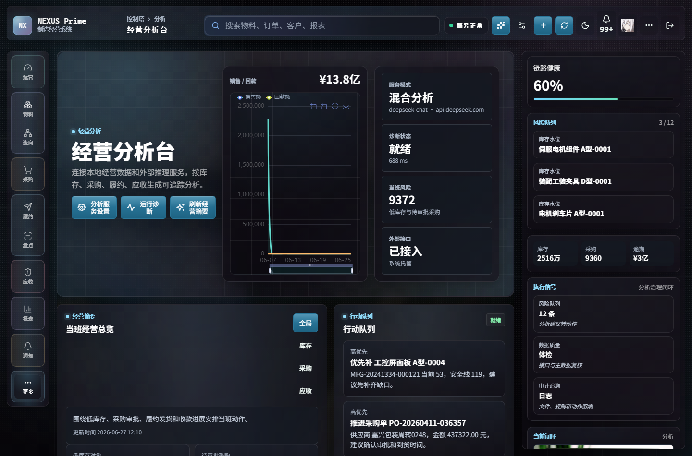

功能点：
- 发起经营问答
- 生成结构化分析
- 查看 AI 会话和动作草稿

升级说明：分析域覆盖报表、规则、数据质量、集成和 AI。它把系统状态、数据可信度和经营建议放到一套分析流程里。本页按照“上方真实图和关键图表、中部交互报表、下方表单和分页操作台”的原则组织，避免无意义跳转方框和页面内多套入口竞争。

### 32. 个人中心

- 路由：`/app/profile`
- 桌面截图：`docs/images/final/pages/desktop-light-luxury-profile.png`（亮色系统）
- 移动截图：`docs/images/final/pages/mobile-light-luxury-profile.png`
- 页面定位：个人中心管理身份资料、头像、偏好、工作负载和最近业务入口。
- 主要数据：当前用户、头像、偏好、通知和待办。
- 主要接口：`me/profile, me/avatar, me/preferences, operations/todo`
- 代码关联：`profile.page.ts + me/profile + me/preferences`

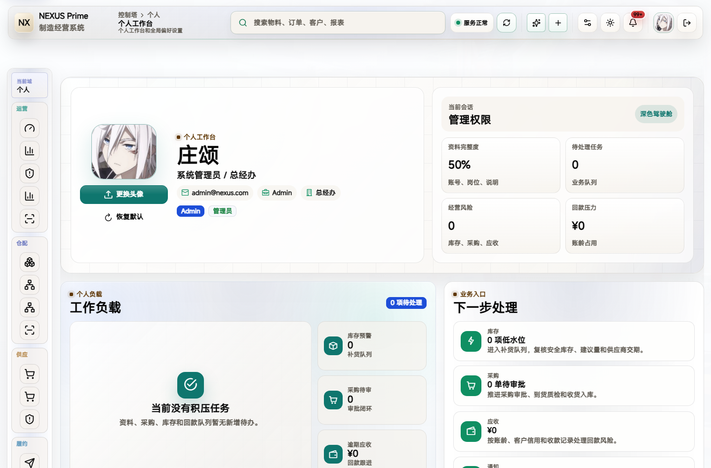

功能点：
- 更新个人资料
- 上传或恢复头像
- 查看个人待办和偏好

升级说明：个人域覆盖个人资料、头像、偏好、默认工作台和控制中心。它把用户自己的工作环境整理为可维护的独立区域。本页按照“上方真实图和关键图表、中部交互报表、下方表单和分页操作台”的原则组织，避免无意义跳转方框和页面内多套入口竞争。

### 33. 控制中心

- 路由：`/app/settings`
- 桌面截图：`docs/images/final/pages/desktop-dark-cockpit-settings.png`（深色驾驶舱）
- 移动截图：`docs/images/final/pages/mobile-light-luxury-settings.png`
- 页面定位：控制中心管理主题、密度、部署状态、AI 配置提示和系统能力概览。
- 主要数据：个人偏好、健康检查、AI 状态和系统配置摘要。
- 主要接口：`me/preferences, health, observability/metrics`
- 代码关联：`settings.page.ts + health + preferences + theme`

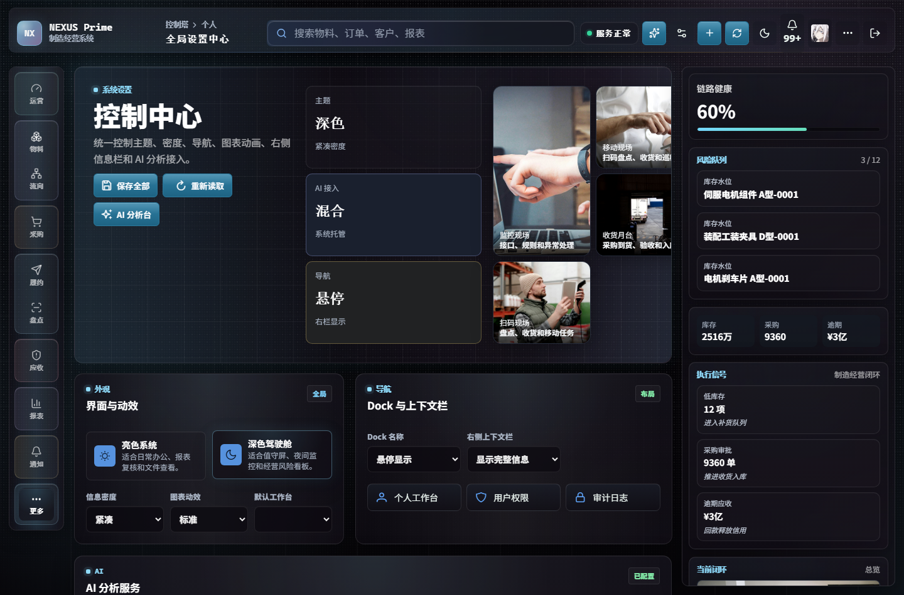

功能点：
- 查看运行配置
- 调整主题偏好
- 检查部署就绪和系统能力

升级说明：个人域覆盖个人资料、头像、偏好、默认工作台和控制中心。它把用户自己的工作环境整理为可维护的独立区域。本页按照“上方真实图和关键图表、中部交互报表、下方表单和分页操作台”的原则组织，避免无意义跳转方框和页面内多套入口竞争。

## 7. 核心代码讲解

- **前端 API 总线**：`frontend/src/app/core/api.service.ts`。统一封装 HttpClient、withCredentials、查询参数和 envelope 解包。页面组件不再散落拼接 URL，也不直接处理后端统一响应结构，从而降低每个业务页重复错误处理的概率。
- **认证与会话恢复**：`frontend/src/app/core/auth.service.ts, auth.guard.ts, auth.interceptor.ts`。登录结果写入 sessionStorage 和 CSRF 缓存，真正的会话凭据保留在 HttpOnly Cookie 中；刷新页面时 authGuard 会先检查 Cookie hint，再通过 /auth/me 恢复用户，避免误把可恢复会话踢回登录页。
- **主题与偏好**：`frontend/src/app/core/theme.service.ts`。主题源被收敛为 dark-cockpit 与 light-luxury 两个实际展示状态，写入 localStorage 与用户偏好；切换后同时更新 html class、data-theme 和 nexus-theme-change 事件，图表与组件可以同步刷新。
- **导航壳层**：`frontend/src/app/shell/app-shell.component.ts`。登录后页面统一进入 App Shell。它管理 Dock、顶部栏、搜索防抖、通知轮询、服务健康、路由 loading 和页面滚动复位，避免各页面自己实现一套壳层逻辑。
- **左侧 Dock**：`frontend/src/app/shell/app-dock.component.ts, frontend/src/app/core/navigation.ts`。Dock 数据来自统一导航模型，按运营、仓配、供应、履约、财务、分析、协作、安全、个人分组。按钮不再做拉长动画，采用稳定图标、短标签、当前态和文字浮窗。
- **顶部导航**：`frontend/src/app/shell/app-topbar.component.ts`。顶部栏合并品牌、面包屑、搜索、服务健康、快捷创建、AI、设置、主题、通知、头像与退出，避免页面上出现多套跳转规则并行。
- **模块操作台**：`frontend/src/app/shell/resource-workbench.component.ts, frontend/src/app/core/resource-workflow.ts`。对可 CRUD 的模块提供统一搜索、分页、详情、创建、编辑、删除、导出和领域动作配置。页面上方负责看业务态势，下方负责实际数据操作。
- **后端认证权限**：`backend/app/api/auth_routes.py, backend/app/platform/auth/decorators.py, backend/app/platform/policy/policy_engine.py`。后端集中处理登录、注册、CSRF、JWT、权限装饰器、管理员覆盖、资源权限、对象授权和字段过滤，前端展示权限不是最终安全边界。
- **通用 CRUD**：`backend/app/api/generic_crud_routes.py, backend/app/platform/crud/*`。资源注册表统一接入列表、详情、搜索、创建、更新、删除、分页和审计。新增资源时优先注册资源配置，而不是复制一组相似接口。
- **完整库启动**：`backend/scripts/bootstrap_sqlite.py`。CloudRun 启动时读取 backend/.env，下载完整 SQLite 压缩库，解压到 /tmp/nexus-prime，执行写锁测试、pragma quick_check 和最小数据量断言，防止空库误上线。
- **腾讯云发布脚本**：`deploy/tencent-cloudbase-auto-deploy.ps1`。脚本负责准备后端 CloudRun 源码、写入生产环境变量、构建前端、上传静态托管路径，并支持完整库引导参数与唯一版本后缀。

## 8. 部署流程

1. 本地确认完整库位于 `backend/instance/nexus_prime.db`。
2. 压缩为 `nexus_prime_full_06292108.db.gz`，上传到 CloudBase 静态托管 `nexus-data/` 目录。
3. 后端部署时设置 `DATABASE_URL=sqlite:////tmp/nexus-prime/nexus_prime.db`、`NEXUS_DB_BOOTSTRAP_URL`、`NEXUS_DB_BOOTSTRAP_FORCE=true`、`NEXUS_DB_BOOTSTRAP_MIN_USERS=15000`、`NEXUS_DB_BOOTSTRAP_MIN_ORDERS=100000`。
4. CloudRun 容器启动时先运行 `python scripts/bootstrap_sqlite.py`，确认完整数据后再执行 `flask db upgrade` 和 `gunicorn`。
5. 前端构建时写入 `NEXUS_API_BASE_URL`，部署到 CloudBase 静态托管唯一路径。
6. 用健康检查、登录接口和数据计数确认线上不是空库。

## 9. 交付结论

NEXUS Prime 已经完成从旧 Flask 单体页面到前后端分离 ERP 工作台的升级。云端使用完整本地演示数据库，包含 15001 个用户和完整业务数据；报告、ER 图、截图、代码说明、架构说明、升级思路、部署过程和视频讲稿均已补齐。
