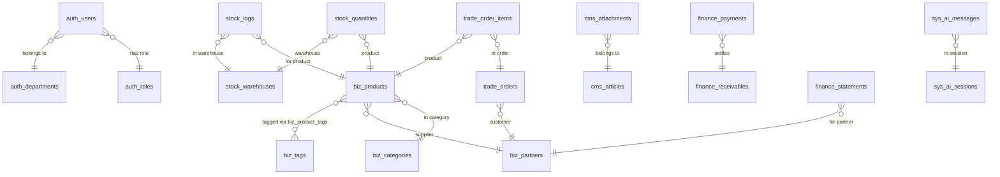

# NEXUS PRIME 项目说明报告

版本：1.0  |  作者：NEXUS PRIME Team  |  部署目标：Railway

---

## 系统简介

NEXUS PRIME 是一体化的中小企业运营管理系统，围绕“商品-仓储-交易-财务-内容-系统运营”六大领域构建。它通过统一的 Web 界面与规范化的数据模型，帮助团队快速完成：

- 基础主数据管理：用户、角色、部门、商品、分类、标签、合作伙伴（客户/供应商）。
- 业务核心流程：采购、入库、出库、盘点、销售、订单、库存流水与预警。
- 财务对账与支付：应收、实收、对账单与客户信用管理。
- 内容与通知：系统公告、文章与附件、通知中心与审计日志。
- 报表统计与 AI 辅助：内置聚合报表与可选的 AI 助手（DeepSeek），支持本地回退模式。

系统目标是将分散的业务数据打通，实现规模化运营过程中的“数据可见、流程可控、结果可追”。

---

## 数据库设计图（ER 图）

下方为核心实体及关系的简化 ER 图，覆盖主数据与交易域。完整模型请参考项目的 `migrations/versions` 和导出的 CSV 表结构。



此外，项目还包含：

- `report_subscriptions` 报表订阅；
- `stock_alerts` 库存预警；
- `stock_take_*` 系列盘点表；
- `supplier_performance` 供应商绩效；
- `sys_audit_logs` 审计日志；
- `sys_notifications` 系统通知。

> 如需生成可视化 PNG，请将 `docs/er.mmd` 导入 [Mermaid Live Editor](https://mermaid.live/) 并导出图片，保存为 `docs/images/er.png`。

---

## 功能模块图

主要模块与职责如下：

- 认证与权限（Auth）：登录/注册、角色、部门、权限守卫。
- 商品与主数据（Biz）：分类、标签、产品、合作伙伴（客户/供应商）。
- 仓储与库存（Stock）：仓库、库存数量、库存流水、库存预警。
- 交易与订单（Trade）：订单、订单明细、订购与出库流程。
- 采购管理（Purchase）：采购单与采购明细、价格历史。
- 盘点管理（Stocktake）：盘点计划、盘点明细、盘点确认与历史。
- 财务与结算（Finance）：应收、实收、对账单、客户信用管理。
- 内容管理（CMS）：文章与附件、公告发布。
- 报表中心（Reports）：销量、库存周转、客户分析等聚合报表。
- 系统管理（System）：设置、通知中心、审计日志、主题切换。
- AI 辅助（AI）：DeepSeek 接入与本地回退，辅助问答与报表洞察。

---

## 核心代码解析

这里选取应用工厂与 CLI 造数命令，说明体系结构与关键流程。

1) 应用工厂 `app/__init__.py:create_app`

```python
def create_app(config_name='default'):
    app = Flask(__name__)
    app.config.from_object(config[config_name])
    config[config_name].init_app(app)

    # 初始化扩展
    db.init_app(app); migrate.init_app(app, db)
    login_manager.init_app(app); cache.init_app(app)
    assets.init_app(app); csrf.init_app(app)

    # 日志、蓝图、错误处理、CLI
    configure_logging(app)
    register_blueprints(app)
    register_error_handlers(app)
    register_commands(app)
    return app
```

- 设计亮点：以工厂模式解耦环境与扩展；`ProductionConfig` 自动修正 Railway 的 `postgres://`；日志输出到 `stdout` 便于平台聚合，且同时支持旋转文件。

2) 造数命令 `app/commands.py:forge`

```python
@click.command('forge')
@click.option('--scale', default=10)
@with_appcontext
def forge(scale):
    db.drop_all(); db.create_all()
    init_auth(scale); products = init_biz(scale)
    init_stock(products, scale)
    init_trade(products, scale)
    init_cms(scale)
```

- 设计亮点：模块化造数，按批次提交以降低事务压力；通过 `scale` 实现数据规模弹性；造数覆盖 Auth/Biz/Stock/Trade/CMS 全链路，便于演示与测试。

3) 数据迁移脚本 `migrate_data.py`

- 导出：自动枚举 SQLite 实际存在表，逐表生成 CSV，见 `data_export/*.csv`。
- 导入：使用 PostgreSQL `COPY ... FROM STDIN` 高速导入，导入前可选 `--truncate` 清空并重置序列；自动禁用/恢复外键与触发器；按 CSV 表头与库列取交集避免列不匹配。

---

## 系统截图（占位）

请在部署后截取 3–4 张关键页面，并保存到 `docs/images/`：

- `docs/images/dashboard.png`：系统仪表盘（主页总览）。
- `docs/images/inventory.png`：库存列表或库存调整页面。
- `docs/images/orders.png`：订单列表或下单流程页面。
- `docs/images/system-settings.png`：系统设置或通知中心。

在 Markdown 中引用如下（占位已添加）：


> 生成 PDF：使用 VS Code 的 “Markdown PDF” 插件，或用浏览器打开并打印为 PDF，或使用 `pandoc` / `weasyprint`。

---

## 部署与运维建议（摘要）

- 环境变量：必须设置 `SECRET_KEY`（随机字符串）、`FLASK_ENV=production`、`DATABASE_URL`（Railway Postgres，建议带 `sslmode=require`）。
- 日志：生产环境日志输出到 `stdout` 与旋转文件（`logs/nexus_prime.log`），便于排查。
- 静态与上传：当前上传目录位于容器磁盘（临时），生产建议接入对象存储（如 S3）以持久化。
- 迁移：使用 Flask-Migrate（Alembic），执行 `flask db upgrade` 应用最新结构。
- 备份与导入：`migrate_data.py` 支持 CSV 导出/导入，可作为迁移与灾备工具。

---

（完）