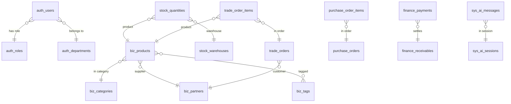

# NEXUS 前后端分离项目说明报告

学生：庄颂  
学号：20241334  
项目名：NEXUS  
技术路线：Flask REST API + Angular 21 SPA + PrimeNG 21 + Lucide + ECharts

## 1. 系统简介

NEXUS 是一个面向商务运营场景的综合管理系统，覆盖商品库存、销售订单、采购入库、应收财务、库存盘点、通知预警、报表分析、CMS 文件和经营分析会话等模块。原系统由 Flask 同时负责后端业务逻辑、数据库访问和 Jinja2 页面渲染；本次改造将其拆分为 `backend/` Flask REST API 与 `frontend/` Angular 21 SPA。旧版快照保留在 `legacy/monolith-flask/`，用于报告对照和答辩说明，不参与新版运行、构建或部署。

新版不仅完成前后端分离，还按照企业级后台产品标准重构了前端信息架构。系统采用 Stripe Dashboard 的资源导航和全局搜索思路、Linear 的命令菜单和快捷操作思路、Shopify Polaris Index Table 的对象列表和批量操作思路，并以 Ant Design / PrimeNG 21 作为 Angular 组件基础。

参考资料：

- Stripe Dashboard Basics：https://docs.stripe.com/dashboard/basics
- Linear Conceptual Model：https://linear.app/docs/conceptual-model
- Linear Filters：https://linear.app/docs/filters
- Shopify Polaris Index Table：https://polaris.shopify.com/components/tables/index-table
- Shopify Polaris Index Filters：https://polaris-site-prod-kit.shopify.prod.shopifyapps.com/components/selection-and-input/index-filters
- Ant Design Design Values：https://ant.design/docs/spec/values/

映射到 NEXUS 的具体做法是：借鉴 Stripe Dashboard 的资源搜索、经营首页和业务监控，形成顶部搜索、运营首页和异常中心；借鉴 Linear 的命令式跳转和过滤视图，形成快捷搜索、模块库和 URL 筛选；借鉴 Polaris Index Filters 的保存视图、搜索、筛选与批量操作，形成高密度资源工作台；借鉴 Ant Design 的自然、确定、反馈和成长性价值，控制页面层级、状态反馈和组件一致性。

## 2. 严格批判与改造目标

从竞争对手忠实用户角度看，旧版和上一版前端的主要问题不是“不能用”，而是“不像真实可日常使用的运营后台”：

- 导航只是模块菜单，缺少工作区切换、全局搜索、最近访问、通知入口和命令菜单。
- 通用 `/:module` 路由把库存、销售、采购、财务都做成同一张表，业务语义弱。
- 表格缺少保存视图、筛选芯片、批量选择、批量动作、密度切换和详情侧栏。
- 销售订单、采购审批/收货、应收收款、盘点完成等流程不应只放在简单弹窗里。
- 视觉层级偏默认组件拼装，大面积空白、表格动作杂乱、信息密度不足。
- 前端文件堆在 `pages/*.page.ts`，不利于扩展、测试和截图验收。

改造目标：

- 形成“运营工作台”而不是“CRUD 页面集合”。
- 前端路由显式表达业务路径。
- 后端 API 统一使用 `/api/v1`，保留少量资源级旧路径兼容，但运营动作统一使用新版语义路径，旧的 `*-legacy` 动作别名已移除。
- 让命令菜单、异常中心、保存视图、筛选、批量动作、详情 drawer、业务动作和审计日志成为可验收功能。
- 文档、截图、测试、PDF 和压缩包全部与真实代码一致。

## 3. 架构改造

### 3.1 原 Flask 单体架构

原系统结构是典型 B/S 单体应用：

- Flask routes 接收请求后直接查询数据库并渲染 Jinja2 模板。
- Flask-WTF 表单在服务端生成表单控件并校验。
- Flask-Login 使用 session 维护登录状态。
- Flash 消息通过模板渲染显示操作结果。
- Bootstrap 与自定义 CSS 直接写在模板页面中。

这种方式适合快速开发，但页面、状态、表单、接口和业务逻辑耦合较重，不符合本课程对 Angular 17+ 与前后端分离的要求。

### 3.2 新前后端分离架构

```text
Angular 21 SPA
  Router / Guard / Interceptor / Service / RxJS / PrimeNG 21
          |
          | HTTP JSON + HttpOnly Cookie + CSRF
          v
Flask REST API /api/v1
  Auth / Overview / Resource API / Search / Preferences / Bulk Actions
          |
          v
SQLAlchemy Models + Service Layer + SQLite/PostgreSQL
```

关键变化：

- 后端运行代码统一收敛到 `backend/`，保留模型、服务层和迁移；旧 Flask/Jinja2 单体保留在 `legacy/monolith-flask/` 作为对照快照，但已从活跃运行、构建和部署边界移除。
- 新增 `backend/app/api/`，提供 RESTful JSON API、Cookie/CSRF、统一响应、异常中心和错误处理。
- 新增 Flask-CORS，允许 Angular 前端调用后端。
- 新增 Angular 21 项目 `frontend/`，使用 Standalone Components。
- 新前端使用 `core/`、`shell/`、`pages/` 分层，删除废弃通用页面入口。
- 旧模板、页面蓝图和旧静态资源不再参与启动、部署和 API 调用，当前运行路径只包含 `backend/` 与 `frontend/`；`legacy/monolith-flask/` 仅用于说明旧版如何升级到新版。

### 3.3 原系统迁移对应关系

| 原 Flask 单体内容 | 新前后端分离实现 |
| --- | --- |
| Flask routes 返回 HTML | Flask API 返回 `{ data, message, error }` JSON |
| Jinja2 templates | Angular standalone pages + AppShell |
| Flask-WTF 表单 | Angular 响应式表单 + 后端接口校验 |
| Flask flash 消息 | PrimeNG `MessageService` + Interceptor 统一错误提示 |
| Flask-Login session | HttpOnly Cookie + CSRF + Angular Guard + 后端会话校验 |
| Bootstrap 页面 | PrimeNG 21 + 自定义高密度后台视觉系统 |
| Railway 部署目标 | Vercel 前后端分离 + Supabase PostgreSQL |
| 上传目录混放 | 头像、附件、资料库三类专用目录，生产接 Cloudinary |

## 4. 数据库设计

系统使用 SQLAlchemy ORM，核心表远超过任务书要求的 3 张表，并包含一对多与多对多关系。

主要实体：

- `auth_users`、`auth_roles`、`auth_departments`：用户、角色、部门。
- `biz_products`、`biz_categories`、`biz_partners`、`biz_tags`：商品、分类、客户/供应商、标签。
- `stock_warehouses`、`stock_quantities`、`stock_logs`：仓库、库存数量、库存流水。
- `trade_orders`、`trade_order_items`：销售订单与明细。
- `purchase_orders`、`purchase_order_items`：采购订单与明细。
- `finance_receivables`、`finance_payments`、`finance_statements`：应收、收款、对账单。
- `stock_takes`、`stock_take_items`：盘点单与盘点明细。
- `sys_notifications`、`stock_alerts`、`stock_replenishment_suggestions`：通知、库存预警、补货建议。
- `cms_articles`、`cms_attachments`：文章与附件。
- `sys_ai_sessions`、`sys_ai_messages`：经营分析会话与消息。

核心关系：

- 分类 `Category` 一对多商品 `Product`。
- 商品 `Product` 与标签 `Tag` 多对多。
- 订单 `Order` 一对多订单明细 `OrderItem`。
- 商品和仓库通过 `Stock` 形成库存关联表。
- 应收账款 `Receivable` 一对多收款记录 `PaymentRecord`。

ER 图源码位于 `docs/er.mmd`。

正式 ER 图文件位于 `docs/images/final/er-diagram.svg`，用于最终报告和展示截图。


```mermaid
erDiagram
  auth_users }o--|| auth_roles : "has role"
  auth_users }o--|| auth_departments : "belongs to"
  biz_products }o--|| biz_categories : "in category"
  biz_products }o--|| biz_partners : "supplier"
  biz_products }o--o{ biz_tags : "tagged"
  stock_quantities }o--|| biz_products : "product"
  stock_quantities }o--|| stock_warehouses : "warehouse"
  trade_orders }o--|| biz_partners : "customer"
  trade_order_items }o--|| trade_orders : "in order"
  trade_order_items }o--|| biz_products : "product"
  purchase_order_items }o--|| purchase_orders : "in order"
  finance_payments }o--|| finance_receivables : "settles"
  sys_ai_messages }o--|| sys_ai_sessions : "in session"
```

## 5. 后端 API 设计

API 前缀统一为 `/api/v1`，统一响应结构如下：

```json
{
  "data": {},
  "message": "操作结果",
  "error": null
}
```

状态码覆盖 `200`、`201`、`400`、`401`、`403`、`404`、`500`。列表接口统一支持 `page`、`page_size`、`q` 和模型字段筛选，并返回分页元数据。

### 5.1 认证接口

| 方法 | URL | 功能 | 登录 |
| --- | --- | --- | --- |
| POST | `/auth/register` | 注册并返回 Cookie/CSRF | 否 |
| POST | `/auth/login` | 登录并返回 Cookie/CSRF | 否 |
| POST | `/auth/logout` | 退出登录 | 是 |
| GET | `/auth/me` | 当前用户 | 是 |

### 5.2 规范业务路径

| 方法 | URL | 功能 |
| --- | --- | --- |
| GET | `/overview/summary` | 运营首页指标 |
| GET | `/overview/charts` | 图表数据 |
| GET | `/inventory/products` | 商品工作台 |
| GET | `/inventory/stock` | 库存列表 |
| GET | `/inventory/replenishment-suggestions` | 补货建议 |
| GET | `/sales/orders` | 销售订单 |
| GET | `/procurement/orders` | 采购订单 |
| GET | `/finance/receivables` | 应收账款 |
| GET | `/stocktakes` | 盘点单 |
| GET | `/notifications` | 通知 |
| GET | `/reports` | 报表历史 |
| GET | `/content/articles` | 内容公告 |
| GET | `/files` | 文件 |
| GET | `/ai/sessions` | 经营分析会话 |
| GET | `/system/users` | 用户管理 |
| GET | `/system/audit` | 审计日志 |

旧路径如 `/products`、`/orders`、`/purchase-orders`、`/generated-reports` 继续兼容，但 README 和前端统一使用新路径。

### 5.3 体验支撑 API

| 方法 | URL | 功能 |
| --- | --- | --- |
| GET | `/search?q=` | 跨商品、订单、采购单、应收、文章、文件搜索 |
| GET/PUT | `/me/preferences` | 保存视图、密度、列配置、最近访问、工作区偏好 |
| POST | `/bulk-actions` | 白名单批量动作 |
| GET | `/meta/navigation` | 导航元数据、权限和计数 |
| GET | `/operations/todo` | 运营首页待办 |
| GET | `/operations/exceptions` | 经营异常中心 |

### 5.4 关键业务动作

| 方法 | URL | 功能 |
| --- | --- | --- |
| POST | `/sales/orders` | 创建销售订单 |
| POST | `/procurement/orders/<id>/submit` | 提交采购审批 |
| POST | `/procurement/orders/<id>/approve` | 审批采购单 |
| POST | `/procurement/orders/<id>/receive` | 采购收货入库 |
| POST | `/finance/receivables/<id>/payment` | 应收收款 |
| POST | `/stocktakes/<id>/start` | 开始盘点 |
| POST | `/stocktakes/<id>/complete` | 完成盘点并可自动调整 |
| POST | `/inventory/replenishment-suggestions/<id>/accept` | 补货建议转采购单 |
| POST | `/files/upload` | 上传文件 |
| GET | `/export/<resource>/<format>` | 导出 CSV/Excel/PDF |

关键动作会写入 `sys_audit_logs`，例如登录、创建订单、采购审批、采购收货、财务收款、文件上传、批量删除和偏好更新。经营数据初始化使用：

```powershell
cd backend
..\venv\Scripts\python.exe -m flask seed-enterprise --scale 3 --multiplier 300 --reset --seed 20241334
..\venv\Scripts\python.exe -m flask status
```

该命令生成中文企业经营数据，覆盖用户、商品、客户、供应商、仓库、库存流水、销售订单、采购订单、应收、收款、盘点、通知、报表、经营分析会话和审计日志。

## 6. Angular 前端设计

前端位于 `frontend/`，采用 Angular 21 Standalone Components。最新目录如下：

```text
src/app/
├── core/
│   ├── api.service.ts
│   ├── auth.service.ts
│   ├── auth.guard.ts
│   ├── auth.interceptor.ts
│   ├── models.ts
│   ├── navigation.ts
│   ├── theme.service.ts
│   └── echarts-layout.ts
├── shell/
│   └── app-shell.component.ts
├── pages/
│   ├── command-center.page.ts
│   ├── materials.page.ts
│   ├── reports.page.ts
│   ├── ai.page.ts
│   ├── record-detail.page.ts
│   ├── page-utils.ts
│   └── workspace-data.ts
├── app.routes.ts
├── app.config.ts
└── app.ts
```

显式路由结构：

- `/auth/login`，注册流程在登录页内通过模式切换完成
- `/app/overview`
- `/app/inventory/products`、`/app/inventory/stock`、`/app/inventory/replenishment`
- `/app/sales/orders`
- `/app/procurement/orders`
- `/app/finance/receivables`
- `/app/stocktakes`
- `/app/notifications`
- `/app/reports`
- `/app/content/articles`、`/app/files`
- `/app/ai`
- `/app/system/users`、`/app/system/audit`
- `/app/profile`

旧路径保留重定向，例如 `/dashboard -> /app/overview`、`/inventory -> /app/inventory/products`。

### 6.1 竞品级交互落地

- `AppShell`：顶部经营命令栏、底部悬浮 dock、更多模块抽屉、通知、主题切换、用户入口和移动端导航。
- 顶部搜索：支持物料、订单、客户、文件、报表和业务入口的即时跳转。
- `page-utils.ts`：收敛金额、日期、状态、分页和图表布局工具，减少页面重复逻辑。
- `record-detail.page.ts`：统一承接列表详情、文件详情、报表详情和业务对象详情。
- `ThemeService` 与 ECharts：统一亮暗色、图表布局和标签防重叠规则。

## 7. 核心代码解析

### 7.1 后端 Cookie/CSRF 权限校验

`backend/app/api/auth.py` 中的 `@jwt_required` 同时支持 HttpOnly Cookie 和 Bearer Token。浏览器 Cookie 模式下，写请求必须通过 CSRF 校验；脚本 Bearer Token 模式不需要 CSRF Header。

```python
def jwt_required(fn):
    @wraps(fn)
    def wrapper(*args, **kwargs):
        bearer_token = get_bearer_token()
        token = bearer_token or request.cookies.get(ACCESS_COOKIE_NAME)
        if not token:
            return api_error('请先登录', status=401, error='missing_token')
        if not bearer_token and request.method in MUTATING_METHODS and not csrf_is_valid():
            return api_error('CSRF 校验失败，请刷新后重试', status=403, error='csrf_failed')
        try:
            payload = decode_access_token(token)
            user_id = int(payload.get('sub'))
        except jwt.ExpiredSignatureError:
            return api_error('登录已过期，请重新登录', status=401, error='token_expired')
        user = db.session.get(User, user_id)
        if not user or not user.is_active:
            return api_error('用户不存在或已被禁用', status=401, error='inactive_user')
        g.api_user = user
        return fn(*args, **kwargs)
    return wrapper
```

### 7.2 Angular Interceptor

`frontend/src/app/core/auth.interceptor.ts` 自动携带 Cookie，并在写请求中加入 `X-CSRF-Token`。遇到登录态失效时跳回登录页，其他错误通过 PrimeNG 消息提示。

```ts
export const authInterceptor: HttpInterceptorFn = (req, next) => {
  const csrfToken = MUTATING_METHODS.has(req.method) ? readCookie(CSRF_COOKIE_NAME) : '';
  const request = req.clone({
    withCredentials: true,
    setHeaders: csrfToken ? { [CSRF_HEADER_NAME]: csrfToken } : {}
  });

  return next(request).pipe(catchError((error: HttpErrorResponse) => {
    if (error.status === 401 && !req.url.includes('/auth/login')) {
      router.navigate(['/auth/login'], { queryParams: { redirect: router.url } });
    }
    messages.add({ severity: 'warn', summary: '操作未完成', detail: error.error?.message || error.message });
    return throwError(() => error);
  }));
};
```

### 7.3 认证入口独立样式层

首页、登录页和注册流程不再继续堆叠在通用业务样式中，而是由 `frontend/src/auth-entry.scss` 维护。该文件在 `angular.json` 中排在 `src/styles.scss` 之后，专门处理首屏高度、真实图片拼接、登录双栏居中、注册单卡流程、浅色对比和移动端滚动。这样既修复认证页被历史全局样式覆盖的问题，也让后续维护能快速定位。

### 7.4 RxJS 搜索与分页

通用列表接口统一通过 `ApiService.list` 传入 `page`、`page_size`、`q`、`sort` 和 `order`。各页面把分页、搜索、筛选和详情页跳转收敛成一致交互。

```ts
this.api.list<DataRecord>('inventory/products', {
  page: this.page(),
  page_size: this.pageSize(),
  q: this.query(),
  sort: this.sortField(),
  order: this.sortOrder()
}).subscribe(result => this.pageResult.set(result));
```

### 7.5 Dock 与模块库

`AppShell` 使用 `navigation.ts` 中的模块定义渲染底部 Dock 和右侧模块库。主 Dock 保留高频流程，省略号抽屉包含全部页面跳转。

```ts
const DESKTOP_DOCK_KEYS = [
  'overview', 'materials', 'flow', 'procurement', 'fulfillment',
  'stocktake', 'receivables', 'reports', 'ai', 'notifications',
  'files', 'security', 'settings'
] as const;
```

## 8. 系统截图

截图文件位于 `docs/images/final/`。


## 9. 测试与部署

后端测试：

```powershell
cd backend
..\venv\Scripts\python.exe -m pytest
```

覆盖认证、权限、商品 CRUD、分页搜索排序、旧路径兼容、新规范路径、全局搜索、偏好保存、批量动作、异常中心、审计日志、经营数据 seed、销售/采购创建、PDF 导出、文件上传和报表生成。

前端测试：

```powershell
cd frontend
npm test -- --watch=false
```

覆盖 Auth 拦截器、主题服务、工作台数据、图表布局审计和主要页面布局审计。认证入口已用 Playwright 复核首页、登录页和注册流程截图。

生产构建：

```powershell
cd frontend
npm run build
```

部署目标：

- Flask API：健康检查 `/api/v1/health`，生产数据库目标为 Supabase PostgreSQL。
- Vercel：前端 Angular SPA，`frontend/vercel.json` 支持 history 路由回退。

## 10. 问题与总结

本次改造最大的难点是“功能可用”和“产品可用”之间的差距。旧系统业务表和服务层较完整，但前端体验像模块 CRUD 拼装。重构后，系统从路径、视觉、交互和 API 都按运营后台重新组织：用户先看到运营首页，再通过分组导航、命令菜单和高密度工作台完成日常动作。

另一个难点是兼容与重构的平衡。为了不破坏旧接口，后端保留 `/api/v1/<resource>`，同时新增 `/api/v1/inventory/products` 等规范路径；前端保留旧路由重定向，但所有新页面都使用 `/app/*` 路径。

通过本次改造，NEXUS 已从 Flask 单体页面系统升级为 Flask REST API + Angular 21 SPA 的前后端分离系统，并补齐 Cookie/CSRF、Guard、Interceptor、RxJS、Router、图表、上传、导出、分页筛选排序、异常中心、审计日志、企业经营数据、保存视图、批量动作、测试、部署文档和企业级前端设计等要求。


